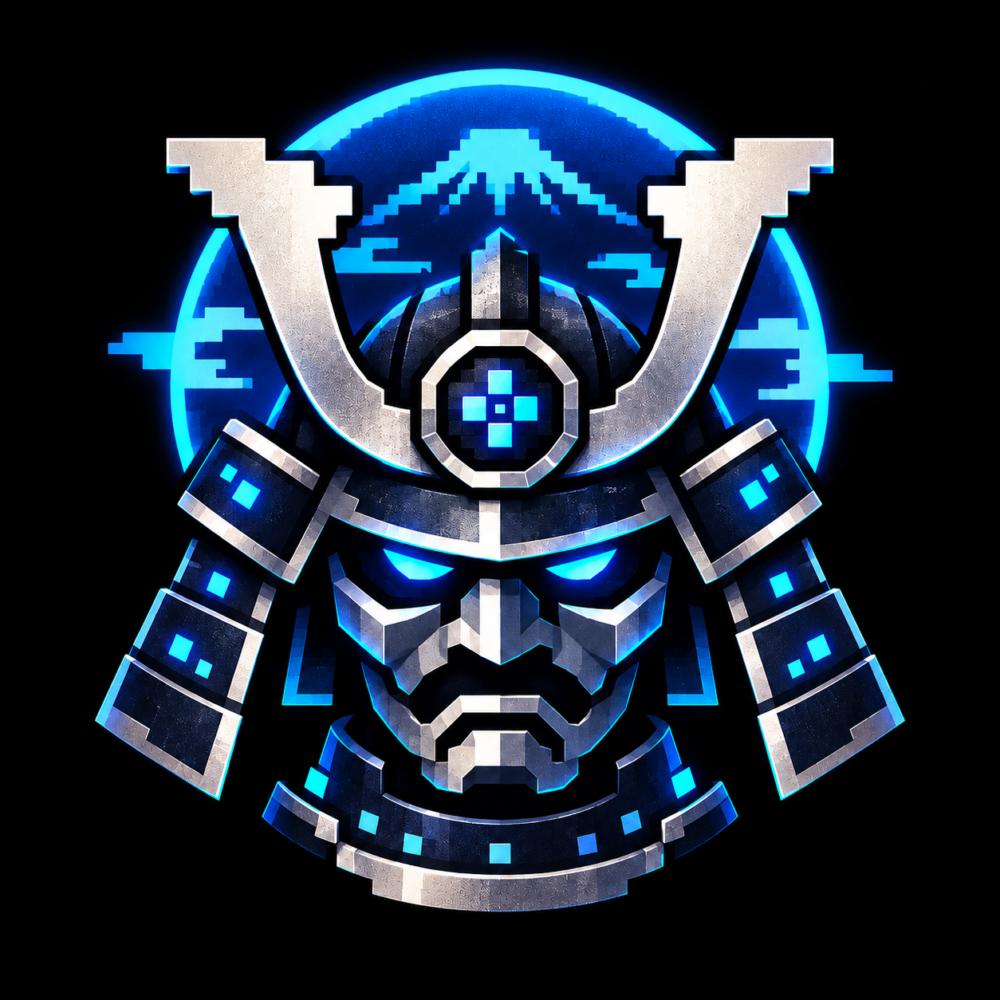

<p align="center">
  
</p>

<h1 align="center">Shogun Emulator</h1>

<p align="center"><a href="#english">English</a> | <a href="#日本語">日本語</a></p>

---

## English

Shogun Emulator is an NES (Famicom) emulator for macOS, Windows, and Linux, written in Go. It plays `.nes` ROMs and includes development tools: pattern table, nametable, sprite, and palette viewers, a memory hex editor, a disassembler, breakpoints, and step execution. AI agents and other programs can also control, observe, and debug the emulator through the Agent Interface, either as an MCP server or over JSON-RPC.

### Features

| Area | Details |
|---|---|
| Regions | NTSC, PAL, Dendy (detected automatically from the ROM header) |
| Mappers | NROM (0), MMC1 (1), UxROM (2), CNROM (3), MMC3 (4), AxROM (7), GxROM (66) |
| Play | Save states with slots, rewind, fast-forward, slow motion, frame advance, input movie recording and playback, screenshots |
| Debugging | CPU debugger, breakpoints, step by cycle, instruction, scanline, or frame, memory viewer and editor, PPU and APU viewers, CPU trace log, ca65/ld65 `.dbg` symbols |
| Automation | Headless mode, MCP server (`shogun mcp`), JSON-RPC server (`shogun serve`), scenario runner (`shogun run`) |

### Installation

Download the installer for your OS from [GitHub Releases](https://github.com/takaaki-mizuno/shogun-emulator/releases).

| OS | File |
|---|---|
| macOS 11 or later (Apple silicon and Intel) | `.dmg`. Open it and drag **Shogun Emulator** to **Applications** |
| Windows 10 or later (x64 and Arm64) | `.msi` installer, or `.zip` to run without installing |
| Linux (x86-64 and arm64) | `.deb` (Debian, Ubuntu), `.rpm` (Fedora, RHEL, openSUSE), AppImage, or `.tar.gz` |

The binaries are not signed. On first launch, macOS Gatekeeper and Windows SmartScreen show a warning. On macOS, Control-click the app and choose **Open**. On Windows, click **More info** and then **Run anyway**.

### Building

Requirements:

- Go 1.25 or later
- A C compiler (cgo is required by the GUI toolkit [Fyne](https://fyne.io/))
- Linux only: `libgl1-mesa-dev libxi-dev libxcursor-dev libxrandr-dev libxinerama-dev libxxf86vm-dev xorg-dev`

```sh
go build ./cmd/shogun
```

`tools/build.sh` makes a release build with version information embedded. The output goes to `dist/<GOOS>_<GOARCH>/`.

### Usage

```sh
shogun game.nes
shogun --scale 4 --region pal game.nes
shogun --headless --frames 60 --screenshot out.png game.nes
shogun --help
```

Default keys for player 1:

| Button | Key |
|---|---|
| D-pad | Arrow keys |
| A / B | X / Z |
| Start / Select | Enter / Right Shift |

| Action | Key |
|---|---|
| Pause / frame advance | Space / `.` |
| Fast-forward / slow motion / rewind (hold) | Tab / `` ` `` / Backspace |
| Reset | F1 |
| Save state / load state | F5 / F7 |
| Previous / next slot | F4 / F6 |
| Screenshot / fullscreen | F12 / F11 |

You can change key bindings and settings from the Settings menu. The user interface is in Japanese.

### Using it from an AI agent

To register a headless emulator that only the AI uses with Claude Code:

```sh
claude mcp add shogun -- shogun mcp
```

To share the window you are watching with the AI, start the emulator with `--agent` (or choose 「AI からの接続を許可」 in the AI menu), then register it with `--attach`:

```sh
claude mcp add shogun-gui -- shogun mcp --attach
```

If a ca65/ld65 `.dbg` file sits next to the ROM, the agent can refer to variables and labels by name.

### Testing

```sh
go run ./tools/fetch-test-roms   # downloads third-party test ROMs into testdata/roms/
go test ./...
```

`testdata/roms/` is excluded from the repository. Tests that need a ROM that has not been downloaded are skipped. The ROMs under `testdata/agent/` are built from the assembly sources in the same directory.

### Packaging

`go run ./tools/package <macos|windows|linux>` creates the release files.

| OS | Files | Tools |
|---|---|---|
| macOS | `.dmg` | `hdiutil` and `tiffutil` (run on macOS) |
| Windows | `.msi` and `.zip` | [WiX Toolset](https://wixtoolset.org/) v5 for the `.msi` (run on Windows) |
| Linux | `.deb`, `.rpm`, `.tar.gz`, and AppImage | nfpm (pinned in `go.mod`); `appimagetool` for the AppImage |

Pushing a tag that starts with `v` builds all release files on GitHub Actions and creates a draft release.

### Documentation

The design specifications are in `docs/specifications/` (Japanese).

### License

[MIT](LICENSE)

---

## 日本語

将軍エミュレータ（Shogun Emulator）は、Go で書いた NES（ファミリーコンピュータ）のエミュレータです。macOS・Windows・Linux で動作します。`.nes` の ROM を遊べるほか、開発用の道具として次のものを備えています。

- パターンテーブル・ネームテーブル・スプライト・パレットのビューア
- メモリの 16 進エディタ
- 逆アセンブラ
- ブレークポイントとステップ実行

AI エージェントなどのプログラムからも、Agent Interface（MCP サーバまたは JSON-RPC）を通して操作・観測・デバッグができます。

### 機能

| 分類 | 内容 |
|---|---|
| リージョン | NTSC・PAL・Dendy（ROM のヘッダから自動で判別） |
| マッパー | NROM（0）、MMC1（1）、UxROM（2）、CNROM（3）、MMC3（4）、AxROM（7）、GxROM（66） |
| プレイ | スロット付きのセーブステート、巻き戻し、早送り、スロー、コマ送り、入力ムービーの記録と再生、スクリーンショット |
| デバッグ | CPU デバッガ、ブレークポイント、サイクル・命令・スキャンライン・フレーム単位のステップ実行、メモリビューアとエディタ、PPU と APU のビューア、CPU トレースログ、ca65/ld65 の `.dbg` のシンボル |
| 自動化 | headless モード、MCP サーバ（`shogun mcp`）、JSON-RPC サーバ（`shogun serve`）、Scenario の実行（`shogun run`） |

### インストール

[GitHub Releases](https://github.com/takaaki-mizuno/shogun-emulator/releases) から OS に合ったファイルを取得します。

| OS | ファイル |
|---|---|
| macOS 11 以降（Apple シリコン・Intel） | `.dmg`。開いて「Shogun Emulator」を「Applications」へドラッグする |
| Windows 10 以降（x64・Arm64） | `.msi`（インストーラ）。インストールせずに使うときは `.zip` |
| Linux（x86-64・arm64） | `.deb`（Debian・Ubuntu）、`.rpm`（Fedora・RHEL・openSUSE）、AppImage、`.tar.gz` |

署名をしていないため、初回の起動で macOS の Gatekeeper と Windows の SmartScreen の警告が出ます。macOS ではアプリを Control キーを押しながらクリックして「開く」を選びます。Windows では「詳細情報」を押してから「実行」を押します。

### ビルド

必要なもの:

- Go 1.25 以降
- C コンパイラ（GUI ツールキットの [Fyne](https://fyne.io/) が cgo を使うため）
- Linux のみ: `libgl1-mesa-dev libxi-dev libxcursor-dev libxrandr-dev libxinerama-dev libxxf86vm-dev xorg-dev`

```sh
go build ./cmd/shogun
```

`tools/build.sh` を使うと、バージョン情報を埋め込んだリリースビルドを作れます。出力先は `dist/<GOOS>_<GOARCH>/` です。

### 使い方

```sh
shogun game.nes
shogun --scale 4 --region pal game.nes
shogun --headless --frames 60 --screenshot out.png game.nes
shogun --help
```

プレイヤー 1 のキーの既定の割り当て:

| ボタン | キー |
|---|---|
| 十字キー | 矢印キー |
| A・B | X・Z |
| Start・Select | Enter・右 Shift |

| 操作 | キー |
|---|---|
| 一時停止・コマ送り | Space・`.` |
| 早送り・スロー・巻き戻し（押している間） | Tab・`` ` ``・Backspace |
| リセット | F1 |
| セーブステート・ロードステート | F5・F7 |
| スロットを前へ・次へ | F4・F6 |
| スクリーンショット・フルスクリーン | F12・F11 |

キーの割り当てと設定は、設定メニューから変えられます。

### AI から使う

AI だけが使う、画面を出さないエミュレータを Claude Code に登録するとき:

```sh
claude mcp add shogun -- shogun mcp
```

人が見ている画面を AI と共有するときは、エミュレータを `--agent` 付きで起動します（「AI」メニューの「AI からの接続を許可」を選んでも同じです）。そのうえで `--attach` 付きで登録します。

```sh
claude mcp add shogun-gui -- shogun mcp --attach
```

ROM と同じ場所に ca65/ld65 の `.dbg` を置くと、AI は変数やラベルを名前で扱えます。

### テスト

```sh
go run ./tools/fetch-test-roms   # 外部のテスト ROM を testdata/roms/ へ取得する
go test ./...
```

`testdata/roms/` はリポジトリに含めていません。取得していない ROM を使うテストは飛ばされます。`testdata/agent/` の ROM は、同じディレクトリにあるアセンブリのソースからビルドしたものです。

### 配布物の作成

`go run ./tools/package <macos|windows|linux>` を実行すると、OS ごとに次の配布物を作ります。

| OS | 配布物 | 使うツール |
|---|---|---|
| macOS | `.dmg` | `hdiutil`・`tiffutil`（macOS で実行する） |
| Windows | `.msi`・`.zip` | `.msi` は [WiX Toolset](https://wixtoolset.org/) v5（Windows で実行する） |
| Linux | `.deb`・`.rpm`・`.tar.gz`・AppImage | nfpm（`go.mod` で版を固定）。AppImage は `appimagetool` |

`v` で始まるタグを push すると、GitHub Actions がすべての配布物を作り、リリースの下書きを作ります。

### ドキュメント

設計書は `docs/specifications/` にあります（日本語）。

### ライセンス

[MIT](LICENSE)
