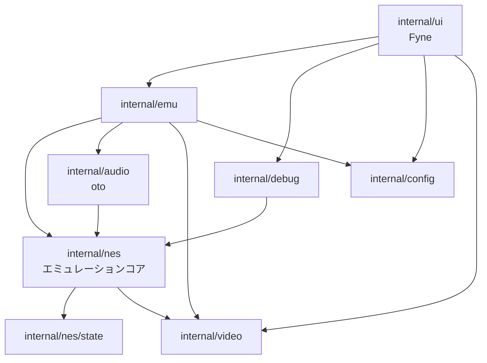
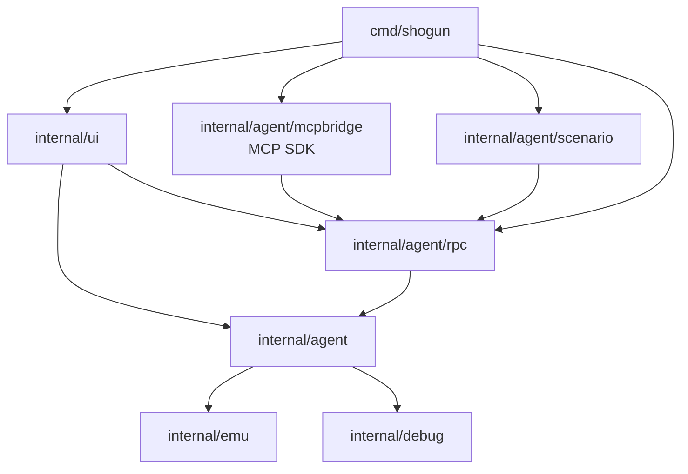
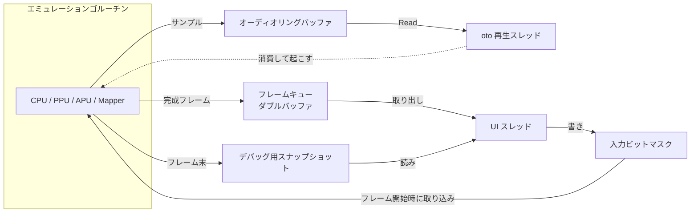

# 01 全体アーキテクチャ設計

- 文書バージョン: 1.1
- 作成日: 2026-09-21
- 更新日: 2026-10-04（Agent Interface の追加に伴い §1.3・§1.4・§1.5・§1.10 を更新）
- 対象システム: Shogun Emulator（将軍エミュレータ）

---

## 1.1 対象システム

Shogun Emulator は NES / ファミリーコンピュータのエミュレータである。GUI アプリケーションとして起動し、コマンドラインからも起動できる。macOS・Windows・Linux で動作する。

対象とする構成を次に定める。この文書群は、この構成についてのみ記述する。

| 分類 | 対象 |
|---|---|
| エミュレートするハードウェア | NTSC 機（RP2A03 + RP2C02）。PAL 機（RP2A07 + RP2C07）と Dendy はリージョン定数として定義する |
| ROM 形式 | iNES、NES 2.0 |
| マッパー | 0（NROM）、1（MMC1）、2（UxROM）、3（CNROM）、4（MMC3）、7（AxROM）、66（GxROM） |
| 入力デバイス | 標準コントローラ 2 個 |
| GUI フレームワーク | Fyne v2.8.1 |
| オーディオ出力 | oto v3.5.1 |
| 実装言語 | Go 1.25 以上 |

ハードウェアの挙動の根拠は `docs/research/` の各文書に置く。この文書群はソフトウェアの設計を記述する。

## 1.2 設計の柱

| 柱 | 内容 | 帰結 |
|---|---|---|
| エミュレーションコアを GUI から分離する | `internal/nes` は GUI・オーディオ・ファイル I/O に依存しない | GUI フレームワークを差し替えてもコアは無変更である |
| lock-step でコンポーネントを進める | CPU 1 サイクルごとに PPU 3 ドットと APU 1 サイクルを進める | 命令途中のレジスタ副作用とサイクル単位デバッグが成立する |
| オーディオデバイスの消費を唯一のクロック源とする | エミュレーションの進行速度はオーディオの消費量で決まる | 壁時計を参照しない。音切れが発生しない |
| エミュレーションを決定論的にする | 同じ初期状態と同じ入力から同じ結果を得る | 入力ムービーの再生、巻き戻し、リグレッションテストが成立する |
| 状態を直列化可能に保つ | 全コンポーネントが自身の状態を書き出す | セーブステートと巻き戻しが成立する |

## 1.3 パッケージ構成

```
cmd/shogun/              起動処理。GUI 起動と CLI 起動の分岐
internal/nes/            エミュレーションコア
    cpu/                 6502 コア
    ppu/                 2C02
    apu/                 2A03 の音源部
    cart/                ROM ローダとマッパー
    input/               コントローラ
    bus/                 バス、DMA、オープンバス
    region/              リージョン定数
    state/               状態直列化の基盤
    nes.go               全体の組み立て
internal/emu/            ライフサイクル。ロード、実行、ステップ、速度制御、セーブステート、ムービー
internal/debug/          ブレークポイント、逆アセンブラ、トレース、変更追跡
internal/audio/          リングバッファ、リサンプラ、oto への出力
internal/video/          フレームバッファ、パレット適用、拡大
internal/ui/             GUI。Fyne への依存をここに閉じる
internal/config/         設定ファイル、キーバインド、パス解決
internal/testrom/        テスト ROM ランナー
internal/agent/          Agent Interface。Host、Instance、Control、Agent Command の登録簿、Observation、イベント、常時記録
    rpc/                 JSON-RPC 2.0 のサーバとクライアント、接続先の発見、トークン
    mcpbridge/           MCP ブリッジ。MCP SDK への依存をここに閉じる
    scenario/            Scenario の読み込み・実行・JUnit XML 出力
assets/                  アイコン、既定パレット
tools/spikes/            技術検証コード（独立モジュール）
```

## 1.4 依存方向

依存は上から下への一方向とする。下位は上位を参照しない。



Agent Interface のパッケージは次の向きに依存する。上の図の `UI` と `EMU`・`DBG` の間に置く形になる。



| 規則 | 理由 |
|---|---|
| `internal/agent` 以下は `internal/ui` を参照しない | GUI なしで動く headless と同じコードを使うため |
| `internal/agent/mcpbridge` は `internal/agent` を直接参照せず、`internal/agent/rpc` のクライアントだけを使う | MCP の経路が JSON-RPC を迂回しないため |
| MCP SDK（`github.com/modelcontextprotocol/go-sdk`）を参照するのは `internal/agent/mcpbridge` だけ | SDK の更新の影響を 1 パッケージに閉じる |
| `internal/nes` は Agent Interface のために変更しない | 必要な観測は `Hooks` で行う。コアの分離を保つ |

詳細は「14 Agent Interface 設計」§14.2.2。これらの規則も `internal/arch` の静的検査で強制する（「12 テスト設計」§12.7）。

`internal/nes` が依存するのは Go 標準ライブラリと `internal/nes/state`・`internal/video` のみである。これにより、コアをテストするときに GUI とオーディオデバイスを必要としない。

`internal/video` はフレームバッファの型とその表示への変換だけを持つ葉のパッケージであり、`internal/` 以下のどのパッケージも参照しない。PPU が書き、表示側が読む受け渡しの場であるため、どちらの側にも依存させない。パレット値から RGB への変換はエンファシスを赤・緑・青の順に並んだ 3 bit として受け取る。PPU が `region.Region` の並びからこの順へ正規化して `Frame` へ書くため、`internal/video` は `internal/nes/region` を参照しない。

`assets` は実行ファイルへ埋め込むデータだけを持ち、`embed` 以外を参照しない。埋め込みの宣言は参照するファイルと同じディレクトリ以下にしか書けないため、使う側のパッケージではなくデータの置き場所に宣言を置く。`internal/video` が既定のパレットのためにこれを参照する。

## 1.5 スレッド構成

プロセス内に 3 つの実行主体がある。

| 主体 | 担当 | 触るもの |
|---|---|---|
| メインゴルーチン（Fyne の UI スレッド） | ウィンドウ、描画、入力イベント | UI オブジェクト、共有スナップショット（読み） |
| エミュレーションゴルーチン | CPU・PPU・APU・マッパーの実行 | エミュレーション状態（単独）、リングバッファ（書き）、フレームバッファ（書き） |
| oto の再生スレッド | オーディオ出力 | リングバッファ（読み） |

Agent Interface（「14 Agent Interface 設計」）を有効にしたとき、次の主体が加わる。

| 主体 | 担当 | 触るもの |
|---|---|---|
| 受け付けゴルーチン（Transport ごとに 1 本） | ローカルソケットで接続を受け付ける | 接続の一覧 |
| 接続ゴルーチン（接続ごとに 1 本） | 要求を読み、Agent Command を実行し、応答を書く | コマンドキューへの送信、`WithMachine` による読み出し |
| 各 Instance のエミュレーションゴルーチン | headless の Host は複数の Instance を持ち、Instance ごとにエミュレーションゴルーチンを 1 本持つ | その Instance のエミュレーション状態（単独） |

接続ゴルーチンはエミュレーション状態に直接触れない。Instance ごとのコマンドキューと `WithMachine` を通す。Instance どうしはエミュレーション状態を共有しない（Fork は `SaveState` と `LoadState` による複製で行う）。共有するのは ROM ごとの Symbol と Game State Definition だけであり、これらはロックで守る。

**エミュレーション状態を触るのはエミュレーションゴルーチンだけである。** 他の主体は共有スナップショットとリングバッファ経由でのみ関わる。これにより、エミュレーション結果がゴルーチンのスケジューリングに依存しない。

Fyne の UI オブジェクトは、メインゴルーチン以外から操作するとき `fyne.Do` または `fyne.DoAndWait` を経由する。この 2 関数を呼ぶのは `internal/ui/dispatch.go` のみとする。詳細は「10 GUI 設計」§10.3。

## 1.6 データフロー



進行の駆動は次のとおりである。エミュレーションゴルーチンはリングバッファが高水位に達すると `sync.Cond` でブロックし、oto の再生スレッドが消費したときに起こされる。これによりエミュレーションの進行速度がオーディオデバイスの実クロックに追従する。詳細は「02 エミュレーションコア設計」§2.6。

映像はフレームキューを介して受け渡す。エミュレーションゴルーチンは完成したフレームをキューに置き、前のフレームが未読であれば上書きする。UI スレッドは描画のたびに最新フレームを取り出す。互いに待たない。

## 1.7 決定論の規約

エミュレーション結果を再現可能にするため、`internal/nes` と `internal/emu` のエミュレーション経路に次の制約を課す。

| 禁止 | 代替 |
|---|---|
| `map` のイテレーション | スライスを使う。直列化のためにキー順が必要な場合はソートする |
| ゴルーチンの生成 | エミュレーションは単一ゴルーチンで実行する |
| `time` パッケージの参照 | 進行はオーディオの消費量で決まる。時刻を必要としない |
| `math/rand` のグローバル関数 | シードを保持する専用の生成器を使い、シードを状態に含める |
| 浮動小数点の値による分岐 | 整数または有理数で判定する |
| 浮動小数点による時間の累積 | 分子と分母の整数カウンタで累積する |

電源投入時に実機で値が定まらない状態は、すべて設定値またはシードから決定し、セーブステートと入力ムービーに記録する。対象の一覧は「08 セーブステートと入力ムービー設計」§8.5。

この表が対象とするのは、エミュレーション結果を決める経路である。`internal/emu` のうち、進行をどれだけ待つかを決める部分（「02 エミュレーションコア設計」§2.6 の `Pacer`）と、ゴルーチンの起動・停止はこれに当たらない。待ち時間は次に実行する命令を変えない。

## 1.8 型と命名の規約

| 対象 | 規約 |
|---|---|
| CPU アドレス、PPU アドレス | `uint16` |
| メモリの値、レジスタ | `uint8` |
| サイクル数、ドット数、フレーム数 | `uint64` |
| PPU のパレットインデックス付きピクセル | `uint16`（下位 6 bit がパレット値、上位 3 bit がエンファシス） |
| 16 進数のリテラル | `0x` 表記。文書中のアドレス表記は `$` を用いる |
| ビットフィールドのアクセス | 名前付きメソッドを介する。呼び出し側でシフトとマスクを書かない |
| エクスポートする識別子 | パッケージ外から使うものに限る |

サイクル数に `int` を使わないのは、32 bit 環境で 2^31 サイクル（約 20 分）を超えたときに桁があふれるためである。

## 1.9 エラーの扱い

| 分類 | 扱い |
|---|---|
| ROM の読み込み失敗、形式不正 | `error` を返す。GUI はダイアログで表示する |
| セーブステートの不一致（ROM、マッパー、バージョン） | `error` を返し、理由を含める |
| エミュレーション中に到達した実機で定義のない状態 | 続行し、`warn.compat` カテゴリのログに記録する |
| オーディオデバイスの初期化失敗 | オーディオを無効にして続行する |

エミュレーション中に `panic` を発生させない。到達し得ない分岐はログに記録して既定値を返す。

## 1.10 文書群の構成

| 編 | 対象 |
|---|---|
| 01 全体アーキテクチャ設計 | パッケージ構成、依存方向、スレッド構成、共通規約 |
| 02 エミュレーションコア設計 | バス、クロック、lock-step、リージョン、フック、DMA |
| 03 CPU 設計 | 6502 コアの実装方式、命令表、割り込み |
| 04 PPU 設計 | レンダリング、スクロールレジスタ、スプライト評価 |
| 05 APU 設計 | 5 チャンネル、フレームカウンタ、ミキサー |
| 06 カートリッジとマッパー設計 | ROM ローダ、マッパーインタフェース、各マッパー |
| 07 入力設計 | コントローラ、キーバインド解決 |
| 08 セーブステートと入力ムービー設計 | 状態直列化、決定論、ムービー形式、巻き戻し |
| 09 デバッガ設計 | ブレークポイント、逆アセンブラ、ビューア、ログ |
| 10 GUI 設計 | ウィンドウ構成、描画、UI スレッド境界 |
| 11 設定と CLI 設計 | 設定ファイル、パス解決、コマンドライン |
| 12 テスト設計 | テスト ROM ランナー、往復テスト、決定論テスト |
| 13 ビルドと配布設計 | ビルド、アイコン、パッケージング |
| 14 Agent Interface 設計 | AI エージェントからの操作・観測・デバッグ。Transport、Instance、Observation、Symbol、Game State、Scenario、Diagnostic |
