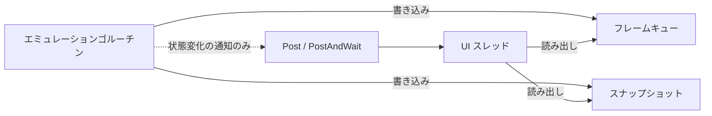

# 10 GUI 設計

- 文書バージョン: 1.0
- 作成日: 2026-09-21
- 対象システム: Shogun Emulator（将軍エミュレータ）

---

## 10.1 ウィンドウ構成

| ウィンドウ | 内容 |
|---|---|
| メイン | ゲーム画面、メニューバー、ステータスバー |
| CPU デバッガ | 逆アセンブル、レジスタ、スタック、コールスタック、ブレークポイント一覧、実行制御 |
| メモリ | 16 進ダンプ。複数開ける |
| パターンテーブル | CHR ビューアと編集 |
| ネームテーブル | 背景ビューアと編集 |
| スプライト | OAM ビューアと編集 |
| パレット | パレットビューアと編集 |
| APU | チャンネル状態 |
| ログ | フィルタ付きのログ表示 |
| 設定 | 設定とキーバインド |

ステータスバーに次を表示する。

| 項目 |
|---|
| フレームレート |
| 速度倍率 |
| ROM 名とマッパー名 |
| 実行状態（実行中・一時停止・ブレーク中） |
| 選択中のセーブステートスロット |
| ムービーの記録中・再生中とフレーム数 |
| 巻き戻し中 |

## 10.2 ビューアの配置

各ビューアを `fyne.CanvasObject` を返すコンポーネントとして実装する。コンポーネントは自身が別ウィンドウに置かれるかタブに置かれるかを知らない。

```go
package ui

type Viewer interface {
    // Title はウィンドウタイトルとタブ名に使う。
    Title() string

    // Content は表示内容を返す。1 回だけ呼ばれる。
    Content() fyne.CanvasObject

    // Update はスナップショットを受け取って表示を更新する。
    // UI スレッドから呼ばれる。
    Update(s *debug.Snapshot)

    // OnClose は表示をやめるときに呼ばれる。
    OnClose()
}
```

配置を 2 通り提供する。設定 `ui.viewerLayout` で選ぶ。既定値は `windows` とする。

| 設定値 | 配置 |
|---|---|
| `windows` | 各ビューアを `App.NewWindow` で別ウィンドウに置く |
| `docked` | メインウィンドウ内の `container.AppTabs` に置く |

```go
type ViewerHost interface {
    Show(v Viewer)
    Hide(v Viewer)
    IsVisible(v Viewer) bool
}

type windowHost struct { app fyne.App; windows map[Viewer]fyne.Window }
type dockedHost struct { tabs *container.AppTabs; items map[Viewer]*container.TabItem }
```

配置の切り替えは実行中に行える。切り替え時に各ビューアの `Content` を作り直す。

## 10.3 UI スレッド境界

Fyne の UI オブジェクトをメインゴルーチン以外から操作するとき `fyne.Do` または `fyne.DoAndWait` を経由する。この 2 関数を呼ぶのは `internal/ui/dispatch.go` のみとする。

```go
package ui

// Post は UI スレッドで fn を実行する。呼び出し元は完了を待たない。
func Post(fn func()) { fyne.Do(fn) }

// PostAndWait は UI スレッドで fn を実行し、完了を待つ。
func PostAndWait(fn func()) { fyne.DoAndWait(fn) }
```

`Post` を用いる。`PostAndWait` はスクリーンショットの取得など、完了を待つ必要がある場合に限る。

エミュレーションゴルーチンから UI を操作しない。エミュレーションゴルーチンは共有構造体へ書き込むだけとし、UI スレッドが自身の描画周期で読み出す。



エミュレーションゴルーチンが `Post` を使うのは、ブレークポイントで停止したときのようにウィンドウの表示状態を変える必要がある場合に限る。毎フレームの画面更新には使わない。

### 10.3.1 CI での検査

`internal/nes`、`internal/emu`、`internal/debug` に `fyne.` を含む識別子が現れないことを検査する。`internal/ui` 内で `fyne.Do` と `fyne.DoAndWait` を呼ぶのが `dispatch.go` のみであることを検査する。検査は「12 テスト設計」§12.7 に定める。

## 10.4 ゲーム画面の描画

```go
type screen struct {
    img    *canvas.Image
    rgba   *image.RGBA     // 使い回す。毎フレーム再確保しない
    frame  *video.Frame    // 取り出したフレームの置き場。表示側が持つ
    pal    *video.Palette
    src    image.Rectangle // 表示するフレーム上の範囲
    frames *emu.FrameBuffer
}

func (s *screen) refresh() {
    if !s.frames.Take(s.frame) {
        return
    }
    s.pal.ApplyRect(s.frame, s.src, s.rgba)   // パレットインデックス → RGBA
    s.img.Refresh()
}
```

フレームの受け渡しは 2 段になる。PPU が書くフレームキュー（`video.Queue`）はエミュレーションゴルーチンからのみ触る。エミュレーションゴルーチンは完成したフレームを `emu.FrameBuffer` へ複製し、UI スレッドはそこから自分のフレームへ複製して読む。

```go
package emu

// FrameBuffer はエミュレーションゴルーチンから UI スレッドへ完成した
// フレームを渡す。
type FrameBuffer struct { /* ... */ }

func (b *FrameBuffer) Put(f *video.Frame)           // エミュレーションゴルーチン
func (b *FrameBuffer) Take(dst *video.Frame) bool   // UI スレッド
func (b *FrameBuffer) Stats() (produced, dropped uint64)
```

複製するのは、表示が読んでいる間にエミュレーションが同じ領域へ書き込むことを避けるためである。1 フレームは 120 KiB であり、複製の費用は 1 フレームの予算（16.7 ミリ秒）に対して無視できる。表示が取りに来る前に次のフレームが来たときは上書きし、その回数を数える。エミュレーションを表示で律速させない。

`canvas.Image` の `ScaleMode` を、設定 `video.filter` が `nearest` のとき `canvas.ImageScalePixels`、`linear` のとき `canvas.ImageScaleSmooth` とする。`nearest` では拡大時にドットがぼけない。

`Refresh` はダーティフラグを立てるだけで即座に返る。実際の描画は Fyne の描画ループがディスプレイの垂直同期に合わせて行う。

`refresh` を呼ぶ周期を Fyne のフレーム駆動に載せる。終わらないアニメーション（`fyne.AnimationRepeatForever`）として登録すると、描画ループが画面を描く直前に UI スレッドから呼ぶ。

```go
anim := fyne.NewAnimation(cycle, func(float32) { u.refresh() })
anim.RepeatCount = fyne.AnimationRepeatForever
app.Driver().StartAnimation(anim)
```

自前のゴルーチンからタイマーで `Post` しない。Fyne は終了処理が始まった後、`fyne.Do` に渡した関数を呼び出し元のゴルーチンで実行する。終了と画面の更新が重なると、UI オブジェクトを UI スレッド以外から触ることになり、スレッドモデルの警告が出る。

フレームが無いときは何もしない。アニメーションの進捗（0 から 1）は使わない。呼ばれること自体を周期実行として用いる。

### 10.4.1 パレットの適用

```go
package video

type Palette struct {
    // 64 色 × 8 エンファシス状態の RGBA を事前計算する
    table [512]color.RGBA
}

func LoadPalette(data []uint8) (*Palette, error)   // .pal 形式
func DefaultPalette() *Palette

func (p *Palette) Apply(f *Frame, dst *image.RGBA)
```

`.pal` 形式は 64 色分の 192 バイト、またはエンファシス込みの 512 色分の 1536 バイトを受け付ける。192 バイトのとき、エンファシスは成分ごとの減衰として計算する。

エンファシスの 3 bit は赤・緑・青に対応し、PPU が `region.Region` のビット位置からこの順へ正規化して `Frame` へ書く（「01 全体アーキテクチャ設計」§1.4）。

減衰の規則を次のとおり定める。ある成分は、その成分以外のエンファシスビットが 1 つでも立っているとき減衰する。減衰は成分ごとに 1 回だけ掛け、立っているビットの数で重ねない。

| エンファシス | 赤 | 緑 | 青 |
|---|---|---|---|
| なし | 等倍 | 等倍 | 等倍 |
| 赤 | 等倍 | 減衰 | 減衰 |
| 赤・緑 | 減衰 | 減衰 | 減衰 |
| 赤・緑・青 | 減衰 | 減衰 | 減衰 |

強調した色を明るくするのではなく、強調しなかった成分を暗くする。3 つとも立てたときに画面全体が暗くなるのはこのためである（`docs/research/03_ppu.md` §6）。

減衰率を 0.746 とする。`Frame` のエンファシスは 8 通りであり、これを 64 色と掛け合わせた 512 色を起動時に計算して表に持つ。ピクセルごとに乗算を行わない。

既定のパレットは `docs/research/03_ppu.md` の 10.3 節の表を `assets/palettes/default.pal` として埋め込む。

### 10.4.2 拡大とアスペクト比

| 設定 | 内容 |
|---|---|
| `video.scale` | 整数倍率。1 から 8 |
| `video.integerScale` | true のときウィンドウサイズに関わらず整数倍で描く |
| `video.aspectRatioCorrection` | true のとき横を 8:7 に補正する |
| `video.overscanTop` など | 上下左右の隠すピクセル数。既定値は上下 8、左右 0 |

画像の位置と大きさは専用のレイアウトが決め、`canvas.Image` はその矩形いっぱいに引き伸ばして描く（`ImageFillStretch`）。`ImageFillContain` は画像の画素の縦横比を保つため、横 8/7 倍の補正を表せない。

| 設定 | 置き方 |
|---|---|
| 最小の大きさ | 表示する範囲 × `video.scale`。アスペクト比補正のときは横を 8/7 倍する |
| `integerScale` が true | 等倍の大きさ（補正を含む）の整数倍のうち、ウィンドウに収まる最大のものを中央に置く |
| `integerScale` が false | 縦横比を保ってウィンドウに収まる最大の大きさを中央に置く |

映像の設定は設定画面で保存するとすぐに反映する。パレットファイルを差し替えたときは、画面とビューアが同じ変換表を参照し続けるよう、表の中身を入れ替える。読めないときは組み込みのパレットを使う。

```go
package video

type Overscan struct {
    Top, Bottom, Left, Right int
}

// Rect は Frame のうち表示する範囲を返す。
func (o Overscan) Rect(height int) image.Rectangle
```

`Rect` に高さを渡すのは、表示する画の高さがリージョンによって異なるためである（`region.PictureHeight`）。`Frame` は 3 機種とも 240 行を持ち、PAL と Dendy はそのうち 239 行を表示する。

オーバースキャンで隠した領域は描画対象から外す。ウィンドウサイズは隠した後のサイズを基準に決める。隠す量が画の大きさ以上のときは 1 ピクセルを残す。範囲が空になると `canvas.Image` が描画できないためである。

### 10.4.3 スクリーンショット

`video.Frame` から直接 PNG を生成する。画面をキャプチャしない。

```go
func SavePNG(f *Frame, p *Palette, overscan Overscan, height int, path string) error
```

`height` には表示する画の高さを渡す。`Overscan.Rect` と同じ理由で、リージョンによって異なる。

`Refresh` が非同期であるため、画面に出ている内容と `Frame` の内容が一致するとは限らない。`Frame` を直接用いることで、保存した画像とエミュレーション状態が対応する。

## 10.5 メニュー

```go
func buildMainMenu(a *app.App) *fyne.MainMenu
```

| メニュー | 項目 |
|---|---|
| ファイル | ROM を開く、最近使った ROM、ROM を閉じる、終了 |
| 実行 | 一時停止、コマ送り、リセット、ハードリセット、速度（倍率の一覧）、巻き戻し |
| ステート | クイックセーブ、クイックロード、スロット選択、名前を付けて保存、ファイルから読み込み |
| ムービー | 記録開始、記録停止、再生、停止 |
| 表示 | 拡大率、フルスクリーン、パターンテーブル、ネームテーブル、スプライト、パレット、APU、CPU デバッガ、メモリ（開くたびに新しいビューア）、ログ、配置の切り替え |
| デバッグ | ブレークポイント一覧、トレースの記録（開始と停止）、トレースの書き出し、トレースの常時出力、ログカテゴリ、オーバーレイの有効・無効、オーバーレイの消去 |
| 設定 | 設定を開く、キーバインドを開く |
| ヘルプ | バージョン情報 |

macOS ではネイティブのメニューバーに表示される。`Window.SetMainMenu` をメインウィンドウに対して呼ぶ。

ブレークポイントで止まったとき、CPU デバッガを表示して前面に出す。ステータスバーの実行状態には止まった理由（どのブレークポイントか）を出し、命令の途中で止まっているときはその旨を添える。

ファイルダイアログは `github.com/ncruces/zenity` を用いる。cgo を必要とせず、各 OS のネイティブダイアログを表示する。

## 10.6 キーイベントの処理

```go
func (u *UI) onKeyDown(ev *fyne.KeyEvent) {
    code, ok := fyneKeyToCode[ev.Name]
    if !ok {
        return
    }
    for _, a := range u.bindings[code] {
        u.dispatchAction(a, true)
    }
}
```

プレイヤー入力のアクションは `input.State` のビットマスクを更新する。ホットキーのアクションはエミュレータへコマンドを送る。

キーリピートを無視する。Fyne のキーイベントに押し続けの通知が含まれる場合、押下状態を自身で保持して変化時のみ処理する。

## 10.7 ウィンドウ状態の保存

各ウィンドウのサイズと表示状態を設定ファイルへ保存する。

```go
type WindowState struct {
    Width, Height int  `json:"width"`
    Visible       bool `json:"visible"`
}
```

位置は保存しない。Fyne の `Window` はウィンドウの位置を取得・設定する手段を持たず、配置は OS のウィンドウマネージャに任せる。そのため、保存した位置が現在のディスプレイ構成の外に出ることも起こらない。

設定 `ui.windows` にウィンドウの名前ごとに持つ。

| 名前 | ウィンドウ |
|---|---|
| `main` | メインウィンドウ |
| `pattern`・`nametable`・`sprite`・`palette`・`apu` | PPU 系と APU のビューア |
| `cpu`・`breakpoints`・`log` | CPU デバッガ・ブレークポイント一覧・ログ |
| `memory` | メモリビューア（複数開いたときは最後に閉じたもの） |

保存の契機を次に示す。

| 契機 |
|---|
| ウィンドウを閉じたとき（サイズを記録し、表示状態を閉じたものとする） |
| アプリケーションを終了するとき（開いているウィンドウのサイズと、表示状態を開いたものとして記録してから保存する） |

起動時はメインウィンドウのサイズを戻し、表示状態が開いたものであるビューアを開き直す（`memory` を除く）。ビューアを開くときに保存したサイズがあれば、そのサイズにする。タブの配置ではサイズを使わず、表示状態だけを使う。

## 10.8 設定画面

設定画面は設定ファイルの構造（「11 設定と CLI 設計」§11.3）に対応するフォームとし、別ウィンドウに開く。編集は保存する設定の写しに対して行い、「保存」で保存する設定へ入れてファイルへ書き、「取り消し」で捨てる。

| タブ | 内容 |
|---|---|
| エミュレーション | リージョン、RAM 初期化、RAM シード、CPU/PPU アライメント、DMA の位相、電源投入時の VBlank フラグ、MMC3 の IRQ 種別、バス競合、DMC DMA のレジスタ競合 |
| 映像 | 拡大率、整数倍、アスペクト比補正、フィルタ、オーバースキャン 4 方向、パレットファイル |
| 音声 | 有効・無効、バッファ長、主音量、チャンネル別音量 5 個、フィルタプロファイル、早送り時のミュート、Triangle の超音波停止 |
| 入力 | ポート 1・2 のデバイス、連射レートの既定値、キーバインド（§10.8.1） |
| パス | ROM・セーブ・ステート・スクリーンショット・ログ・ムービーの保存先 |
| デバッグ | ログカテゴリ、ログの出力先、ローテーションの大きさと世代数、トレースリングの大きさ、変更追跡の減衰、メモリ編集の副作用、未初期化 RAM の読み出しでブレーク |
| ステート | スロット数、スクリーンショットの有無、巻き戻しの有効・無効・保持時間・保存間隔、ムービーのチェックサム間隔・desync での停止・検証 |
| 外観 | テーマ、ビューアの配置、言語 |

各項目に説明を添える。各タブに、変更がいつ効くか（即時・ROM の再読み込み後・再起動後。「11 設定と CLI 設計」§11.3.2）を表示する。環境変数または引数で上書きされている項目には、その旨と使われている値を表示する。

「既定値に戻す」ボタンは写しを既定値にする。「設定ファイルを開く」ボタンは OS のファイラで設定のディレクトリを開く。

サンプリングレートは項目として置かない。48000 Hz に固定している（「11 設定と CLI 設計」§11.3.1）。

### 10.8.1 キーバインドの設定

アクションの一覧を表示し、各アクションに割り当てられた物理キーを並べる。

| 操作 |
|---|
| キーを追加する。押されたキーを取り込む |
| キーを削除する |
| 既定値に戻す |
| 重複した割り当てを強調表示する |

取り込み中はホットキーの処理を止める。取り込み対象のキーがホットキーとして解釈されるのを防ぐ。取り込み中であることを表示し、Escape で取り込みをやめる。変換表（§10.6）に載っていないキーが押されたときは、その旨を表示して割り当てない。

プレイヤー入力のアクションごとに連射レート（0 で無効、1–30 Hz）を設定できる。キーバインドの変更は「保存」で `keybindings.json` へ書き、すぐに操作へ反映する。

## 10.9 文言

画面に出す文言は `internal/ui/i18n` に集め、`internal/ui` のコードには書かない。

```go
package i18n

type ID string

// T は文言を返す。args があるとき fmt.Sprintf の書式として使う。
func T(id ID, args ...any) string
```

文言の表は `ja.go` に置き、言語は日本語だけを持つ。設定 `ui.language` は `ja` だけを受け付ける。文言を集めるのは、言語を加えるときに表を 1 つ足せば済むようにするためである。`internal/ui` の `_test.go` 以外のファイルに日本語の文字列リテラルが無いことを、静的検査（「12 テスト設計」§12.7）で確かめる。

## 10.10 テーマ

設定 `ui.theme` が `light` または `dark` のとき、その配色に固定する。`auto` のとき OS の設定に従う。変更はすぐに反映する。
