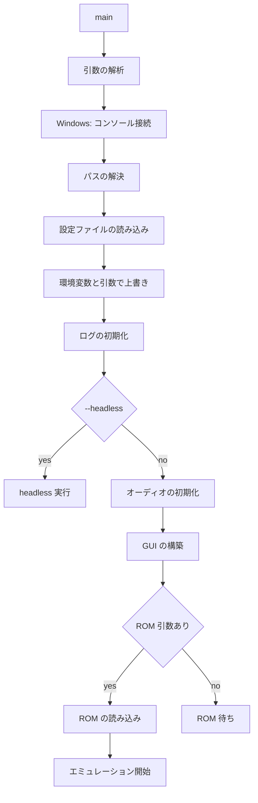

# 11 設定と CLI 設計

- 文書バージョン: 1.1
- 作成日: 2026-09-21
- 更新日: 2026-10-04（Agent Interface の追加に伴い §11.1・§11.2・§11.3・§11.3.1・§11.3.2・§11.5・§11.5.1・§11.5.2・§11.6 を更新し、§11.5.4 を追加）
- 対象システム: Shogun Emulator（将軍エミュレータ）

---

## 11.1 設定の優先順位

```
コマンドライン引数 > 環境変数 > 設定ファイル > 組み込みの既定値
```

環境変数の接頭辞を `SHOGUN_` とする。`SHOGUN_LOG_DIR` のように設定項目のパスを大文字とアンダースコアで表す。

| 環境変数 | 設定項目 |
|---|---|
| `SHOGUN_CONFIG` | 設定ファイルのパス（`--config` と同じ） |
| `SHOGUN_PORTABLE` | `1` でポータブルモード（`--portable` と同じ） |
| `SHOGUN_REGION` | `emulation.region` |
| `SHOGUN_RAM_INIT` | `emulation.ramInitPattern` |
| `SHOGUN_SCALE` | `video.scale` |
| `SHOGUN_AUDIO` | `audio.enabled`（`0` で無効） |
| `SHOGUN_AUDIO_BUFFER` | `audio.bufferMilliseconds` |
| `SHOGUN_ROM_DIR` | `paths.romDir` |
| `SHOGUN_SAVE_DIR` | `paths.saveDir` |
| `SHOGUN_STATE_DIR` | `paths.stateDir` |
| `SHOGUN_SCREENSHOT_DIR` | `paths.screenshotDir` |
| `SHOGUN_LOG_DIR` | `paths.logDir` |
| `SHOGUN_MOVIE_DIR` | `paths.movieDir` |
| `SHOGUN_VIDEO_DIR` | `paths.videoDir` |
| `SHOGUN_LOG` | `debug.logOutput` |
| `SHOGUN_LOG_CATEGORIES` | `debug.logCategories`（カンマ区切り） |
| `SHOGUN_AGENT` | `agent.enabled`（`1` で有効） |
| `SHOGUN_AGENT_LISTEN` | `agent.listen` |

値を解釈できない環境変数は無視し、警告を出す。

環境変数とコマンドライン引数による上書きは設定ファイルへ書き戻さない。一時的な上書きとして扱う。そのため設定を 2 つ持つ。

| 設定 | 内容 |
|---|---|
| 保存する設定 | 設定ファイルの内容。設定画面・メニューの操作・ウィンドウ状態・最近使った ROM の変更はここへ入れ、ファイルへ保存する |
| 使う設定 | 保存する設定に環境変数と引数の上書きを重ねたもの。エミュレータと GUI はこれを使う |

保存する設定を変えたときは、使う設定を上書きし直して作る。

## 11.2 ディレクトリとファイル

アプリケーション識別子を macOS と Windows で `ShogunEmulator`、Linux で `shogun-emulator` とする。

```go
package config

type Paths struct {
    Config      string   // 設定ファイルのディレクトリ
    Data        string   // セーブデータ、ステート、ムービー
    Cache       string
    Logs        string
    Screenshots string
    Videos      string // 録画した動画
}

// Overrides は環境変数と引数で指定された保存先。空の項目は既定の場所を使う。
type Overrides struct {
    Config, Data, Logs, Screenshots, Videos string
}

func ResolvePaths(portable bool, overrides Overrides) (Paths, error)
```

各パッケージは `os.UserConfigDir` などを直接呼ばず、`ResolvePaths` の結果を受け取る。保存先の決め方をポータブルモードと上書きを含めて 1 か所に集めるためである。

| 用途 | macOS | Windows | Linux |
|---|---|---|---|
| 設定 | `~/Library/Application Support/ShogunEmulator/` | `%AppData%\ShogunEmulator\` | `~/.config/shogun-emulator/` |
| データ | 同上 | 同上 | `~/.local/share/shogun-emulator/` |
| キャッシュ | `~/Library/Caches/ShogunEmulator/` | `%LocalAppData%\ShogunEmulator\cache\` | `~/.cache/shogun-emulator/` |
| ログ | `~/Library/Logs/ShogunEmulator/` | `%LocalAppData%\ShogunEmulator\logs\` | `~/.local/state/shogun-emulator/logs/` |
| スクリーンショット | `~/Pictures/ShogunEmulator/` | `%UserProfile%\Pictures\ShogunEmulator\` | `~/Pictures/ShogunEmulator/` |
| 動画 | `~/Movies/ShogunEmulator/` | `%UserProfile%\Videos\ShogunEmulator\` | `~/Videos/ShogunEmulator/` |

設定とキャッシュは `os.UserConfigDir` と `os.UserCacheDir` から求める。これらがエラーを返したときは、ホームディレクトリ直下の `.shogun-emulator` を代わりに使う。ホームディレクトリも求められないときはエラーを返す。Linux のデータディレクトリは `$XDG_DATA_HOME`、未設定なら `$HOME/.local/share` とする。Go の標準ライブラリに対応する関数がないため自身で実装する。Linux のログディレクトリは `$XDG_STATE_HOME`、未設定なら `$HOME/.local/state` とする。

データディレクトリ以下のファイル構成を次に示す。

| 内容 | パス |
|---|---|
| 設定 | `config.json` |
| キーバインド | `keybindings.json` |
| バッテリーバックアップ | `saves/<rom-hash>.sav` |
| セーブステート | `states/<rom-hash>/<slot>.state` |
| 入力ムービー | `movies/<rom-hash>/<name>.movie` |
| シンボルとブレークポイント | `symbols/<rom-hash>.json` |
| トレースの書き出し | `traces/<ROM 名>-<累積サイクル数>.log` |
| CHR と PRG のオーバーレイ | `patches/<rom-hash>.json` |
| Game State Definition（ROM のディレクトリに置けないとき） | `gamestate/<rom-hash>.json`（「14 Agent Interface 設計」§14.12.1） |
| Repro | `repros/<rom-hash>/<日時>.repro/`（同 §14.16.3） |

キャッシュディレクトリ以下に、Agent Interface の接続先を置く（「14 Agent Interface 設計」§14.5.1）。

| 内容 | パス | パーミッション |
|---|---|---|
| 発見ファイル | `agent/<pid>.json` | 0600（Windows は所有者だけに読み書きを許す ACL） |
| Unix ドメインソケット | `agent/<pid>.sock` | 0600 |

接続先をデータディレクトリではなくキャッシュディレクトリに置くのは、プロセスの終了とともに意味を失う一時的なファイルであり、ポータブルモードの利用者の手元に残す必要がないためである。macOS のソケットパスの上限（104 バイト）に収まる短いパスでもある。プロセスが異常終了して残ったファイルは、クライアントが `pid` のプロセスの有無を調べて消す。

`<rom-hash>` はヘッダを除いた PRG-ROM と CHR-ROM の SHA-1 の先頭 16 桁を 16 進で表した文字列とする。ヘッダを含めないのは、同じゲームのダンプでヘッダの内容が異なる場合があり、含めると別のゲームとして扱われるためである。

`ResolvePaths` は求めたディレクトリのうち、設定・データ・ログを作る。スクリーンショット・動画・キャッシュのディレクトリは使うときに作る。

### 11.2.1 ポータブルモード

実行ファイルと同じディレクトリに `portable.txt` が存在するとき、そのディレクトリを保存先とする。`--portable` と `SHOGUN_PORTABLE=1` を指定したときも同じ動作とする。

| 用途 | ポータブルモードの場所 |
|---|---|
| 設定・データ | 実行ファイルのディレクトリ |
| キャッシュ | 同 `cache/` |
| ログ | 同 `logs/` |
| スクリーンショット | 同 `screenshots/` |
| 動画 | 同 `videos/` |

上書き（`Overrides`）はポータブルモードより優先する。

## 11.3 設定ファイル

形式を JSON とする。

```go
type Config struct {
    Version   int             `json:"version"`
    Emulation EmulationConfig `json:"emulation"`
    Video     VideoConfig     `json:"video"`
    Audio     AudioConfig     `json:"audio"`
    Input     InputConfig     `json:"input"`
    Paths     PathsConfig     `json:"paths"`
    Debug     DebugConfig     `json:"debug"`
    State     StateConfig     `json:"state"`
    Movie     MovieConfig     `json:"movie"`
    UI        UIConfig        `json:"ui"`
    Agent     AgentConfig     `json:"agent"`
}
```

すべてのフィールドに `omitempty` を付けない。設定ファイルを開いた利用者が設定可能な項目を一覧できる。

```go
// Load は設定ファイルを読む。warnings は利用者へ知らせる注意。
func Load(path string) (cfg *Config, warnings []string, err error)

// Save は一時ファイルへ書いてから rename する。
func (c *Config) Save(path string) error
```

読み込みの扱いを次に示す。

| 状況 | 扱い |
|---|---|
| ファイルが無い | 既定値を返す |
| JSON として読めない | 既定値を返し、元のファイルを `config.json.broken` へ名前を変えて残す。警告を出す |
| 未知のフィールド | 無視し、フィールドのパスを警告に含める |
| `version` が現在より大きい | 既定値を返し、警告を出す。ファイルは書き換えない |
| `version` が現在より小さい | 移行する（§11.8） |
| 値が範囲外 | その項目を既定値に戻し、警告を出す |
| ファイルに無い項目 | 既定値のまま |

`version` が新しいファイルを書き換えないのは、新しいバージョンに戻したときに設定を失わないためである。このとき保存する設定は既定値となり、終了時にも保存しない。

保存は一時ファイルへ書いて `rename` する。書き込み中の異常終了で設定を失わない。保存の契機は、設定画面での保存、メニューの操作で保存する設定を変えたとき、アプリケーションの終了時である。

### 11.3.1 各セクション

```go
type EmulationConfig struct {
    Region                  string `json:"region"`                  // auto, ntsc, pal, dendy
    RAMInitPattern          string `json:"ramInitPattern"`          // zero, ff, pattern, random
    RAMSeed                 uint64 `json:"ramSeed"`                 // 0 で起動ごとに生成
    CPUPPUAlignment         int    `json:"cpuPpuAlignment"`         // 0..2
    DMAGetPutPhase          int    `json:"dmaGetPutPhase"`          // 0..1
    PPUVBlankFlag           bool   `json:"ppuVBlankFlag"`           // 電源投入時の VBlank フラグ
    MMC3IRQVariant          string `json:"mmc3IrqVariant"`          // sharp, nec
    BusConflicts            string `json:"busConflicts"`            // auto, always, never
    DMCDMARegisterConflicts bool   `json:"dmcDmaRegisterConflicts"`
}

type VideoConfig struct {
    Scale                 int    `json:"scale"`
    IntegerScale          bool   `json:"integerScale"`
    AspectRatioCorrection bool   `json:"aspectRatioCorrection"`
    Filter                string `json:"filter"`                 // nearest, linear
    OverscanTop           int    `json:"overscanTop"`
    OverscanBottom        int    `json:"overscanBottom"`
    OverscanLeft          int    `json:"overscanLeft"`
    OverscanRight         int    `json:"overscanRight"`
    PaletteFile           string `json:"paletteFile"`
    Fullscreen            bool   `json:"fullscreen"`
    RecordScale           int    `json:"recordScale"`            // 録画の拡大率
}

type AudioConfig struct {
    Enabled                  bool               `json:"enabled"`
    SampleRate               int                `json:"sampleRate"`
    BufferMilliseconds       int                `json:"bufferMilliseconds"`
    RingHighWaterMultiplier  int                `json:"ringHighWaterMultiplier"`
    MasterVolume             float64            `json:"masterVolume"`
    ChannelVolumes           map[string]float64 `json:"channelVolumes"`
    FilterProfile            string             `json:"filterProfile"`   // nes, famicom, none
    MuteOnFastForward        bool               `json:"muteOnFastForward"`
    SilenceUltrasonicTriangle bool              `json:"silenceUltrasonicTriangle"`
}
```

```go
type InputConfig struct {
    Port1Device  string `json:"port1Device"`   // standard, none
    Port2Device  string `json:"port2Device"`
    TurboRateHz  int    `json:"turboRateHz"`
}

type PathsConfig struct {
    ROMDir        string `json:"romDir"`
    SaveDir       string `json:"saveDir"`
    StateDir      string `json:"stateDir"`
    ScreenshotDir string `json:"screenshotDir"`
    LogDir        string `json:"logDir"`
    MovieDir      string `json:"movieDir"`
    VideoDir      string `json:"videoDir"`
}

type DebugConfig struct {
    LogCategories     []string `json:"logCategories"`
    LogOutput         string   `json:"logOutput"`         // none, stderr, stdout, file
    LogMaxBytes       int64    `json:"logMaxBytes"`       // ファイル出力のローテーションの大きさ
    LogGenerations    int      `json:"logGenerations"`    // 残す世代数
    TraceRingSize     int      `json:"traceRingSize"`
    ChangeDecayFrames int      `json:"changeDecayFrames"` // 変更追跡の色が消えるまでのフレーム数
    MemoryEditWrite   bool     `json:"memoryEditWrite"`   // メモリビューアの編集に Bus.Write を使う
    BreakOnUninitializedRAMRead bool `json:"breakOnUninitializedRamRead"` // ROM を読み込むたびにイベントブレークポイントを置く
}

type StateConfig struct {
    Slots                int  `json:"slots"`
    RewindEnabled        bool `json:"rewindEnabled"`
    RewindSeconds        int  `json:"rewindSeconds"`
    RewindIntervalFrames int  `json:"rewindIntervalFrames"`
    SaveScreenshot       bool `json:"saveScreenshot"`
}

type MovieConfig struct {
    ChecksumIntervalFrames int  `json:"checksumIntervalFrames"`
    StopOnDesync           bool `json:"stopOnDesync"`
    VerifyChecksums        bool `json:"verifyChecksums"`
}

type UIConfig struct {
    ViewerLayout string                 `json:"viewerLayout"`   // windows, docked
    Language     string                 `json:"language"`       // ja
    Theme        string                 `json:"theme"`          // auto, light, dark
    Windows      map[string]WindowState `json:"windows"`        // 「10 GUI 設計」§10.7
    RecentROMs   []RecentROM            `json:"recentRoms"`     // 新しい順、最大 10 件
}

type RecentROM struct {
    Path string `json:"path"`
    Name string `json:"name"`
}
```

```go
type AgentConfig struct {
    Enabled           bool   `json:"enabled"`           // GUI 版で Agent Interface を有効にする
    Listen            string `json:"listen"`            // unix, tcp:127.0.0.1:PORT
    MaxInstances      int    `json:"maxInstances"`      // headless の Instance の上限
    ROMWatchAction    string `json:"romWatchAction"`    // notify, reload
    ObserveImageScale int    `json:"observeImageScale"` // Observation の画像の既定の拡大率
}
```

| キー | 既定値 | 内容 |
|---|---|---|
| `agent.enabled` | `false` | GUI 版で Agent Interface を有効にする。headless のサブコマンド（§11.5.4）はこの値によらず有効 |
| `agent.listen` | `"unix"` | 接続方式（「14 Agent Interface 設計」§14.5.1） |
| `agent.maxInstances` | 16 | headless の Instance の上限 |
| `agent.romWatchAction` | `"notify"` | GUI 版で ROM ファイルの変化を見つけたときの動作（同 §14.15.2） |
| `agent.observeImageScale` | 2 | Observation の画像の既定の拡大率（同 §14.9.3） |

`agent` セクションの追加は設定ファイルの `version` を上げない。ファイルに無い項目は既定値のままとする規則（§11.3）で、古いファイルをそのまま読めるためである。

空のパスは、そのパスの既定の場所（§11.2）を意味する。パスを空にできるようにするのは、利用者が場所を指定しなかったことと、既定の場所を明示的に指定したことを区別する必要がないためである。

既定値を次に示す。

| 項目 | 既定値 | 根拠 |
|---|---|---|
| `emulation.region` | `auto` | ヘッダのタイミングモードから決める |
| `emulation.ramInitPattern` | `random` | 未初期化 RAM に依存するプログラムの挙動を観測できる |
| `emulation.mmc3IrqVariant` | `sharp` | 後期のプログラムがこの挙動に依存する |
| `emulation.busConflicts` | `auto` | サブマッパーの指定に従う |
| `emulation.dmcDmaRegisterConflicts` | `true` | 回避策を持つプログラムが正しく動作する |
| `video.scale` | 3 | 768×720 になる |
| `video.filter` | `nearest` | 拡大時にドットがぼけない |
| `video.overscanTop` / `overscanBottom` | 8 | 画面端の描画をゲームが整えていない場合がある |
| `video.recordScale` | 2 | 幅が 512 になる（既定のオーバースキャンでは 512×448）。3 倍の半分弱の大きさで、全画面で再生しても粗さが目立ちにくい（「08 セーブステートと入力ムービー設計」§8.8.1） |
| `video.fullscreen` | `false` | 起動時にフルスクリーンにするかを表す。F11 やメニューでの切り替えはこの値を変えない |
| `audio.sampleRate` | 48000 | リサンプル段が 1 つ減る |
| `audio.bufferMilliseconds` | 25 | 高水位 2 倍で合計 50 ms に収まる |
| `audio.ringHighWaterMultiplier` | 2 | 一時的な遅れを吸収する |
| `audio.filterProfile` | `nes` | |
| `state.rewindEnabled` | `true` | |
| `state.rewindSeconds` | 60 | |
| `state.rewindIntervalFrames` | 10 | 60 秒で約 14 MiB になる |
| `movie.checksumIntervalFrames` | 60 | |
| `movie.stopOnDesync` | `true` | |
| `ui.viewerLayout` | `windows` | |
| `ui.language` | `ja` | |
| `ui.theme` | `auto` | OS の設定に従う |
| `input.port1Device` / `port2Device` | `standard` | |
| `input.turboRateHz` | 15 | 1 フレームおきの切り替えに相当する |
| `state.slots` | 10 | |
| `debug.traceRingSize` | 1000000 | |
| `debug.logCategories` | `["warn.compat", "error"]` | まれにしか出ないカテゴリだけを記録し、通常のプレイを遅くしない |
| `debug.changeDecayFrames` | 30 | 約 0.5 秒で色が消える |
| `debug.memoryEditWrite` | `false` | 表示の確認のための編集でレジスタの副作用を起こさない |
| `debug.logOutput` | `stderr` | `warn.compat` と `error` だけが既定で有効であり、出力が少ない |
| `debug.logMaxBytes` | 10485760 | 10 MiB |
| `debug.logGenerations` | 3 | |

`audio.ringHighWaterMultiplier` に 2 未満を指定したとき 2 に丸める。等倍では処理の遅れがそのまま音切れになる。

`audio.sampleRate` は読み込んだ値によらず 48000 とする。`oto.NewContext` をプロセスで 1 回しか呼べず、レートを変えるには再起動が要るためである。レートを変えられる項目として見せず、バッファ長だけを設定できるようにする。

範囲を検証する項目を次に示す。範囲外の値と、選択肢に無い文字列は既定値に戻す。

| 項目 | 範囲 |
|---|---|
| `emulation.region` | `auto`・`ntsc`・`pal`・`dendy` |
| `emulation.ramInitPattern` | `zero`・`ff`・`pattern`・`random` |
| `emulation.cpuPpuAlignment` | 0–2 |
| `emulation.dmaGetPutPhase` | 0–1 |
| `emulation.mmc3IrqVariant` | `sharp`・`nec` |
| `emulation.busConflicts` | `auto`・`always`・`never` |
| `video.scale` | 1–8 |
| `video.recordScale` | 1–3 |
| `video.overscan*` | 0–16 |
| `video.filter` | `nearest`・`linear` |
| `audio.bufferMilliseconds` | 5–200 |
| `audio.masterVolume`・`audio.channelVolumes` の各値 | 0.0–1.0 |
| `audio.filterProfile` | `nes`・`famicom`・`none` |
| `input.port1Device`・`port2Device` | `standard`・`none` |
| `input.turboRateHz` | 1–30 |
| `debug.logOutput` | `none`・`stderr`・`stdout`・`file` |
| `debug.logCategories` | 「09 デバッガ設計」§9.8 のカテゴリ名。知らない名前を除く |
| `debug.traceRingSize` | 1000–10000000 |
| `state.slots` | 1–10 |
| `state.rewindSeconds` | 1–600 |
| `state.rewindIntervalFrames` | 1–60 |
| `movie.checksumIntervalFrames` | 1–3600 |
| `ui.viewerLayout` | `windows`・`docked` |
| `ui.language` | `ja` |
| `ui.theme` | `auto`・`light`・`dark` |
| `ui.recentRoms` | 11 件目以降を捨てる |
| `agent.listen` | `unix`、または `tcp:127.0.0.1:PORT`・`tcp:[::1]:PORT`（`PORT` は 0–65535）。他のアドレスは既定値に戻す |
| `agent.maxInstances` | 1–64 |
| `agent.romWatchAction` | `notify`・`reload` |
| `agent.observeImageScale` | 1–4 |

### 11.3.2 反映の時期

設定画面で保存した変更は、項目ごとに次の時期に効く。設定画面は各タブにこの区別を表示する。

| 時期 | 項目 |
|---|---|
| 即時 | `video` の全項目、`audio` のうちバッファ長・主音量・チャンネル別音量・早送り時のミュート・Triangle の超音波停止、キーバインドと連射、`debug.logCategories`・`debug.memoryEditWrite`・`debug.changeDecayFrames`、`ui.theme`・`ui.viewerLayout` |
| ROM の再読み込み後 | `emulation` の全項目、`audio.filterProfile`、`input.port1Device`・`port2Device`、`paths` の全項目、`state` の全項目、`movie` の全項目、`debug.breakOnUninitializedRamRead` |
| 即時（Agent Interface） | `agent.enabled`（有効にすると待ち受けを始め、無効にすると全接続を切る）、`agent.romWatchAction`、`agent.observeImageScale` |
| 再起動後 | `agent.listen`、`agent.maxInstances`、`audio.enabled`、`debug.logOutput`・`debug.logMaxBytes`・`debug.logGenerations`・`debug.traceRingSize` |

`emulation` を ROM の再読み込み後とするのは、電源投入時の状態とマッパーの挙動を途中から変えると、実機に無い状態が生じるためである。

## 11.4 キーバインドファイル

構造は「07 入力設計」§7.4.3 に定める。ファイル名を `keybindings.json` とする。

設定ファイルと分けるのは、既定値へ戻す操作を設定全体と独立に行えるようにするためである。

```go
// knownCode はキーの変換表（「10 GUI 設計」§10.6）にあるコードかを返す。
// 変換表は GUI の側にあるため、呼び出し側が渡す。
func LoadKeybindings(path string, knownCode func(code string) bool) (k *Keybindings, warnings []string, err error)
func (k *Keybindings) Save(path string) error
```

ファイルが無いときは既定値（「07 入力設計」§7.4.4）を返す。JSON として読めないときは既定値を返し、元のファイルを `keybindings.json.broken` として残す。知らないアクション名と、キーの変換表（「10 GUI 設計」§10.6）に載っていないキーコードは無視し、警告に含める。保存は一時ファイルへ書いて `rename` する。

## 11.5 コマンドライン

```
shogun [オプション] [ROM ファイル]
shogun serve|mcp|ctl|run [サブコマンドの引数...]
```

ROM ファイルを引数に渡すと、それを開いて GUI を起動する。引数がないときは ROM を読み込まずに GUI を起動する。

第 1 引数が `serve`・`mcp`・`ctl`・`run` のどれかのとき、Agent Interface のサブコマンドとして扱う（§11.5.4）。同じ名前の ROM ファイルを開くときは `./serve` のようにパスで渡す。

標準ライブラリの `flag` を用いる。

### 11.5.1 オプション

| オプション | 内容 |
|---|---|
| `--help`, `-h` | ヘルプを表示する |
| `--version` | バージョン、コミットハッシュ、ビルド日時、Go のバージョンを表示する |
| `--config PATH` | 設定ファイルのパスを指定する |
| `--portable` | 実行ファイルのディレクトリを保存先にする |
| `--region {auto,ntsc,pal,dendy}` | リージョンを指定する |
| `--scale N` | 拡大率を指定する |
| `--fullscreen` | フルスクリーンで起動する |
| `--no-audio` | 音声を出力しない |
| `--audio-buffer MS` | オーディオバッファの長さを指定する |
| `--sample-rate HZ` | 48000 だけを受け付ける。他の値は警告して無視する（§11.3.1） |
| `--speed FACTOR` | 実行速度の倍率を指定する |
| `--save-dir PATH` | バッテリーバックアップの保存先を指定する |
| `--state-dir PATH` | セーブステートの保存先を指定する |
| `--load-state PATH` | 起動時にセーブステートを読み込む |
| `--save-state-on-exit PATH` | 終了時にセーブステートを保存する |
| `--movie PATH` | 入力ムービーを再生する |
| `--record-movie PATH` | 入力ムービーを記録する |
| `--record-video PATH` | 動画（MP4）を録画する。終了時に閉じる（「08 セーブステートと入力ムービー設計」§8.8） |
| `--movie-verify`, `--no-movie-verify` | ムービー再生時のチェックサム検証を切り替える（`movie.verifyChecksums`） |
| `--ram-init {zero,ff,pattern,random}` | RAM の初期化パターンを指定する |
| `--ram-seed N` | RAM 初期化の乱数シードを指定する |
| `--deterministic` | 値が定まらない状態をすべて固定値にする |
| `--debug` | CPU デバッガを開き、一時停止した状態で起動する。headless では無視する |
| `--log {stdout,stderr,file}` | ログの出力先を指定する |
| `--log-dir PATH` | ログの保存先を指定する |
| `--log-categories LIST` | ログカテゴリをカンマ区切りで指定する |
| `--trace-log PATH` | CPU トレースをこのファイルへ常時出力する（「09 デバッガ設計」§9.7） |
| `--break-at ADDR` | 起動時に実行ブレークポイントを設定する。16 進（`$C000` または `C000`）。headless では止まった時点で理由を表示して終了する |
| `--agent` | GUI 版で Agent Interface を有効にする（`agent.enabled` を上書き） |
| `--agent-listen ADDR` | `agent.listen` を上書きする |
| `--headless` | GUI を起動せずに実行する |
| `--frames N` | N フレーム実行して終了する |
| `--screenshot PATH` | 終了時にスクリーンショットを PNG で保存する |

引数が不正なとき、および ROM を指定せずに `--headless` を指定したときは、理由を表示して終了コード 2 で終える。`--help` の出力はオプションを「表示と音声」「保存先」「ステートとムービー」「決定論」「デバッグ」「AI」「headless」に分けて並べる。`--agent` と `--agent-listen` は「AI」に、`--record-video` は「ステートとムービー」に置く。サブコマンドの一覧（§11.5.4）をヘルプの末尾に示す。

### 11.5.2 headless モード

`--headless` を指定したとき、ウィンドウを作らずエミュレーションのみを実行する。

```go
func runHeadless(cfg *config.Config, opts headlessOptions) int
```

| 組み合わせ | 用途 |
|---|---|
| `--headless --frames N --screenshot PATH` | 指定フレーム数実行して画面を保存する |
| `--headless --trace-log PATH --frames N` | CPU トレースを取得する |
| `--headless --movie PATH` | ムービーを再生して desync を検査する |
| `--headless --movie PATH --record-video OUT` | ムービーを終わりまで再生し、動画を書き出す。`--frames` を指定したときはそのフレーム数で止める |

headless モードではオーディオデバイスを開かない。進行の駆動をオーディオに依存させず、可能な速度で実行する。 ROM は一時停止した状態で読み込み、`--frames` のフレーム数だけ進める。読み込んだ直後から進むと、`--frames` の数とトレースの先頭が実行ごとに変わるためである。設定ファイルへは書かない。

終了コードを次のとおり定める。

| コード | 意味 |
|---|---|
| 0 | 正常終了 |
| 1 | ROM の読み込みに失敗した |
| 2 | 引数が不正である |
| 3 | ムービーの再生で desync を検出した |
| 4 | テスト ROM が失敗を報告した |
| 5 | Scenario のアサーションが失敗した（`shogun run`） |
| 6 | Scenario ファイルが不正である（`shogun run`） |

headless で `--record-video` の録画が書き込みの失敗で止まったとき、または閉じられなかったときは、エラーを標準エラーに出してコード 1 で終える。動画が残らないため成功とはしない。ムービーの desync（3）を検出していたときはそちらを返す。

### 11.5.3 Windows でのコンソール接続

Windows 向けのビルドに `-H windowsgui` を指定する。GUI 起動時にコンソールウィンドウが表示されない。

コマンドラインから起動されたとき、親プロセスのコンソールへ接続して標準出力を有効にする。

```go
//go:build windows

package main

var procAttachConsole = windows.NewLazySystemDLL("kernel32.dll").NewProc("AttachConsole")

func attachConsoleIfNeeded() {
    if len(os.Args) > 1 {
        procAttachConsole.Call(attachParentProcess) // ATTACH_PARENT_PROCESS = 0xFFFFFFFF
        // CONOUT$ を開き、os.Stdout と os.Stderr をそれに差し替える
    }
}
```

`golang.org/x/sys/windows` は `AttachConsole` の関数を持たないため、`kernel32.dll` から呼ぶ。親プロセスにコンソールが無い（エクスプローラから起動した）ときは接続に失敗し、何もしない。

`--log=stdout` と `--headless` を指定した場合に出力が見えるようにするための処理である。

### 11.5.4 Agent Interface のサブコマンド

| サブコマンド | 動作 | 詳細 |
|---|---|---|
| `shogun serve [--listen ADDR]` | headless の Host を持ち、JSON-RPC で待ち受ける。ROM は `instance.create` で読み込む | 「14 Agent Interface 設計」§14.5.1 |
| `shogun mcp [--attach [PID]] [--rom PATH]` | MCP の stdio サーバ。既定はプロセス内に headless の Host を持つ。`--attach` で起動中のプロセスへ接続する | 同 §14.5.2 |
| `shogun ctl [--pid PID] <名前空間> <操作> [引数...]` | 起動中のプロセスへ接続し、Agent Command を 1 つ実行して結果を表示する | 同 §14.5.3 |
| `shogun run <Scenario...> [--junit PATH] [--update-golden] [--repro-dir DIR]` | Scenario を headless で実行する | 同 §14.17 |

サブコマンドは、それぞれの引数に加えて §11.5.1 のうち次のオプションを受け付ける。それ以外のオプション（表示と音声に関するもの、`--headless` など）は受け付けず、終了コード 2 で終える。

| 受け付けるオプション |
|---|
| `--config`、`--portable` |
| `--region`、`--ram-init`、`--ram-seed`、`--deterministic`（Instance の既定値として使う） |
| `--log`、`--log-dir`、`--log-categories` |

`serve`・`mcp`・`run` はオーディオデバイスを開かず、Instance を `NoPacer` で動かす（§11.5.2 の headless モードと同じ）。設定ファイルへは書かない。

`shogun mcp` は標準出力を MCP のメッセージだけに使う。ログを `--log=stdout` で標準出力へ出す指定は断り、終了コード 2 で終える。MCP のメッセージとログが混ざるとクライアントが読めなくなるためである。

`shogun ctl` の終了コードは、Agent Command が成功したとき 0、エラーを返したとき 1、接続先が見つからないか接続できないとき 2 とする。

## 11.6 起動の流れ



引数の解析の時点で第 1 引数がサブコマンド（§11.5.4）であれば、パスの解決・設定の読み込み・上書き・ログの初期化までを同じ順に行い、GUI とオーディオを初期化せずにサブコマンドの処理へ進む。GUI 版で Agent Interface が有効なときは、GUI の構築の後に待ち受けを始める。

オーディオの初期化に失敗したとき、音声を無効にして GUI の構築を続ける。`oto.NewContext` はプロセスで 1 回だけ呼ぶ。

## 11.7 バージョン情報

```go
var (
    version   = "dev"
    commit    = "none"
    buildDate = "unknown"
)
```

ビルド時に `-ldflags` で埋め込む。`debug.ReadBuildInfo` から取得できる情報も併せて表示する。

## 11.8 設定の移行

`version` が現在より小さいとき、順に移行処理を適用する。

```go
type migration struct {
    from, to int
    apply    func(raw map[string]any) error
}
```

移行は JSON を `map[string]any` として読んだ段階で行い、その後で構造体へ読み込む。移行後の設定を保存する。移行前の内容を `config.json.v<N>.bak`（`<N>` は移行前の `version`）として残す。

| 移行 | 内容 |
|---|---|
| 1 → 2 | `debug.logToFile` を `debug.logOutput` に置き換える。`true` は `file`、`false` は `stderr` とする |
