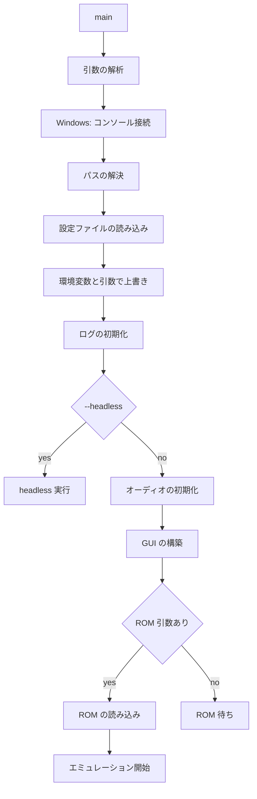

# 11 設定と CLI 設計

- 文書バージョン: 1.0
- 作成日: 2026-09-21
- 対象システム: Shogun Emulator（将軍エミュレータ）

---

## 11.1 設定の優先順位

```
コマンドライン引数 > 環境変数 > 設定ファイル > 組み込みの既定値
```

環境変数の接頭辞を `SHOGUN_` とする。`SHOGUN_LOG_DIR` のように設定項目のパスを大文字とアンダースコアで表す。

コマンドライン引数による上書きは設定ファイルへ書き戻さない。一時的な上書きとして扱う。

## 11.2 ディレクトリとファイル

アプリケーション識別子を macOS と Windows で `ShogunEmulator`、Linux で `shogun-emulator` とする。

```go
package config

type Paths struct {
    Config      string   // 設定ファイルのディレクトリ
    Data        string   // セーブデータ、ステート、ムービー
    Cache       string
    Logs        string
    Screenshots string
}

func ResolvePaths(portable bool, overrides Overrides) (Paths, error)
```

| 用途 | macOS | Windows | Linux |
|---|---|---|---|
| 設定 | `~/Library/Application Support/ShogunEmulator/` | `%AppData%\ShogunEmulator\` | `~/.config/shogun-emulator/` |
| データ | 同上 | 同上 | `~/.local/share/shogun-emulator/` |
| キャッシュ | `~/Library/Caches/ShogunEmulator/` | `%LocalAppData%\ShogunEmulator\cache\` | `~/.cache/shogun-emulator/` |
| ログ | `~/Library/Logs/ShogunEmulator/` | `%LocalAppData%\ShogunEmulator\logs\` | `~/.local/state/shogun-emulator/logs/` |
| スクリーンショット | `~/Pictures/ShogunEmulator/` | `%UserProfile%\Pictures\ShogunEmulator\` | `~/Pictures/ShogunEmulator/` |

設定とキャッシュは `os.UserConfigDir` と `os.UserCacheDir` から求める。Linux のデータディレクトリは `$XDG_DATA_HOME`、未設定なら `$HOME/.local/share` とする。Go の標準ライブラリに対応する関数がないため自身で実装する。Linux のログディレクトリは `$XDG_STATE_HOME`、未設定なら `$HOME/.local/state` とする。

データディレクトリ以下のファイル構成を次に示す。

| 内容 | パス |
|---|---|
| 設定 | `config.json` |
| キーバインド | `keybindings.json` |
| バッテリーバックアップ | `saves/<rom-hash>.sav` |
| セーブステート | `states/<rom-hash>/<slot>.state` |
| 入力ムービー | `movies/<rom-hash>/<name>.movie` |
| シンボルとブレークポイント | `symbols/<rom-hash>.json` |
| トレースの書き出し | `traces/<ROM 名>-<累積サイクル数>.log` |
| CHR と PRG のオーバーレイ | `patches/<rom-hash>.json` |

`<rom-hash>` はヘッダを除いた PRG-ROM と CHR-ROM の SHA-1 の先頭 16 桁を 16 進で表した文字列とする。ヘッダを含めないのは、同じゲームのダンプでヘッダの内容が異なる場合があり、含めると別のゲームとして扱われるためである。

### 11.2.1 ポータブルモード

実行ファイルと同じディレクトリに `portable.txt` が存在するとき、そのディレクトリを設定・データ・ログ・スクリーンショットの保存先とする。`--portable` を指定したときも同じ動作とする。

## 11.3 設定ファイル

形式を JSON とする。

```go
type Config struct {
    Version   int             `json:"version"`
    Emulation EmulationConfig `json:"emulation"`
    Video     VideoConfig     `json:"video"`
    Audio     AudioConfig     `json:"audio"`
    Input     InputConfig     `json:"input"`
    Paths     PathsConfig     `json:"paths"`
    Debug     DebugConfig     `json:"debug"`
    State     StateConfig     `json:"state"`
    Movie     MovieConfig     `json:"movie"`
    UI        UIConfig        `json:"ui"`
}
```

すべてのフィールドに `omitempty` を付けない。設定ファイルを開いた利用者が設定可能な項目を一覧できる。

未知のフィールドは無視し、`warn.compat` ではなく `error` ではない通常のログに記録する。`version` が現在の値より大きいとき、読み込みを中止して既定値で起動する。

保存は一時ファイルへ書いて `rename` する。書き込み中の異常終了で設定を失わない。

### 11.3.1 各セクション

```go
type EmulationConfig struct {
    Region                  string `json:"region"`                  // auto, ntsc, pal, dendy
    RAMInitPattern          string `json:"ramInitPattern"`          // zero, ff, pattern, random
    RAMSeed                 uint64 `json:"ramSeed"`                 // 0 で起動ごとに生成
    CPUPPUAlignment         int    `json:"cpuPpuAlignment"`         // 0..2
    DMAGetPutPhase          int    `json:"dmaGetPutPhase"`          // 0..1
    PPUVBlankFlag           bool   `json:"ppuVBlankFlag"`           // 電源投入時の VBlank フラグ
    MMC3IRQVariant          string `json:"mmc3IrqVariant"`          // sharp, nec
    BusConflicts            string `json:"busConflicts"`            // auto, always, never
    DMCDMARegisterConflicts bool   `json:"dmcDmaRegisterConflicts"`
}

type VideoConfig struct {
    Scale                 int    `json:"scale"`
    IntegerScale          bool   `json:"integerScale"`
    AspectRatioCorrection bool   `json:"aspectRatioCorrection"`
    Filter                string `json:"filter"`                 // nearest, linear
    OverscanTop           int    `json:"overscanTop"`
    OverscanBottom        int    `json:"overscanBottom"`
    OverscanLeft          int    `json:"overscanLeft"`
    OverscanRight         int    `json:"overscanRight"`
    PaletteFile           string `json:"paletteFile"`
    Fullscreen            bool   `json:"fullscreen"`
}

type AudioConfig struct {
    Enabled                  bool               `json:"enabled"`
    SampleRate               int                `json:"sampleRate"`
    BufferMilliseconds       int                `json:"bufferMilliseconds"`
    RingHighWaterMultiplier  int                `json:"ringHighWaterMultiplier"`
    MasterVolume             float64            `json:"masterVolume"`
    ChannelVolumes           map[string]float64 `json:"channelVolumes"`
    FilterProfile            string             `json:"filterProfile"`   // nes, famicom, none
    MuteOnFastForward        bool               `json:"muteOnFastForward"`
    SilenceUltrasonicTriangle bool              `json:"silenceUltrasonicTriangle"`
}
```

```go
type InputConfig struct {
    Port1Device  string `json:"port1Device"`   // standard, none
    Port2Device  string `json:"port2Device"`
    TurboRateHz  int    `json:"turboRateHz"`
}

type PathsConfig struct {
    ROMDir        string `json:"romDir"`
    SaveDir       string `json:"saveDir"`
    StateDir      string `json:"stateDir"`
    ScreenshotDir string `json:"screenshotDir"`
    LogDir        string `json:"logDir"`
    MovieDir      string `json:"movieDir"`
}

type DebugConfig struct {
    LogCategories     []string `json:"logCategories"`
    LogToFile         bool     `json:"logToFile"`
    TraceRingSize     int      `json:"traceRingSize"`
    ChangeDecayFrames int      `json:"changeDecayFrames"` // 変更追跡の色が消えるまでのフレーム数
    MemoryEditWrite   bool     `json:"memoryEditWrite"`   // メモリビューアの編集に Bus.Write を使う
}

type StateConfig struct {
    Slots                int  `json:"slots"`
    RewindEnabled        bool `json:"rewindEnabled"`
    RewindSeconds        int  `json:"rewindSeconds"`
    RewindIntervalFrames int  `json:"rewindIntervalFrames"`
    SaveScreenshot       bool `json:"saveScreenshot"`
}

type MovieConfig struct {
    ChecksumIntervalFrames int  `json:"checksumIntervalFrames"`
    StopOnDesync           bool `json:"stopOnDesync"`
    VerifyChecksums        bool `json:"verifyChecksums"`
}

type UIConfig struct {
    ViewerLayout string `json:"viewerLayout"`   // windows, docked
    Language     string `json:"language"`
    Theme        string `json:"theme"`          // auto, light, dark
}
```

空のパスは、そのパスの既定の場所（§11.2）を意味する。パスを空にできるようにするのは、利用者が場所を指定しなかったことと、既定の場所を明示的に指定したことを区別する必要がないためである。

既定値を次に示す。

| 項目 | 既定値 | 根拠 |
|---|---|---|
| `emulation.region` | `auto` | ヘッダのタイミングモードから決める |
| `emulation.ramInitPattern` | `random` | 未初期化 RAM に依存するプログラムの挙動を観測できる |
| `emulation.mmc3IrqVariant` | `sharp` | 後期のプログラムがこの挙動に依存する |
| `emulation.busConflicts` | `auto` | サブマッパーの指定に従う |
| `emulation.dmcDmaRegisterConflicts` | `true` | 回避策を持つプログラムが正しく動作する |
| `video.scale` | 3 | 768×720 になる |
| `video.filter` | `nearest` | 拡大時にドットがぼけない |
| `video.overscanTop` / `overscanBottom` | 8 | 画面端の描画をゲームが整えていない場合がある |
| `audio.sampleRate` | 48000 | リサンプル段が 1 つ減る |
| `audio.bufferMilliseconds` | 25 | 高水位 2 倍で合計 50 ms に収まる |
| `audio.ringHighWaterMultiplier` | 2 | 一時的な遅れを吸収する |
| `audio.filterProfile` | `nes` | |
| `state.rewindEnabled` | `true` | |
| `state.rewindSeconds` | 60 | |
| `state.rewindIntervalFrames` | 10 | 60 秒で約 14 MiB になる |
| `movie.checksumIntervalFrames` | 60 | |
| `movie.stopOnDesync` | `true` | |
| `ui.viewerLayout` | `windows` | |
| `ui.language` | `ja` | |
| `ui.theme` | `auto` | OS の設定に従う |
| `input.port1Device` / `port2Device` | `standard` | |
| `input.turboRateHz` | 15 | 1 フレームおきの切り替えに相当する |
| `state.slots` | 10 | |
| `debug.traceRingSize` | 1000000 | |
| `debug.logCategories` | `["warn.compat", "error"]` | まれにしか出ないカテゴリだけを記録し、通常のプレイを遅くしない |
| `debug.changeDecayFrames` | 30 | 約 0.5 秒で色が消える |
| `debug.memoryEditWrite` | `false` | 表示の確認のための編集でレジスタの副作用を起こさない |

`audio.ringHighWaterMultiplier` に 2 未満を指定したとき 2 に丸める。等倍では処理の遅れがそのまま音切れになる。

## 11.4 キーバインドファイル

構造は「07 入力設計」§7.4.3 に定める。ファイル名を `keybindings.json` とする。

設定ファイルと分けるのは、既定値へ戻す操作を設定全体と独立に行えるようにするためである。

## 11.5 コマンドライン

```
shogun [オプション] [ROM ファイル]
```

ROM ファイルを引数に渡すと、それを開いて GUI を起動する。引数がないときは ROM を読み込まずに GUI を起動する。

標準ライブラリの `flag` を用いる。

### 11.5.1 オプション

| オプション | 内容 |
|---|---|
| `--help`, `-h` | ヘルプを表示する |
| `--version` | バージョン、コミットハッシュ、ビルド日時、Go のバージョンを表示する |
| `--config PATH` | 設定ファイルのパスを指定する |
| `--portable` | 実行ファイルのディレクトリを保存先にする |
| `--region {auto,ntsc,pal,dendy}` | リージョンを指定する |
| `--scale N` | 拡大率を指定する |
| `--fullscreen` | フルスクリーンで起動する |
| `--no-audio` | 音声を出力しない |
| `--audio-buffer MS` | オーディオバッファの長さを指定する |
| `--sample-rate HZ` | サンプリングレートを指定する |
| `--speed FACTOR` | 実行速度の倍率を指定する |
| `--save-dir PATH` | バッテリーバックアップの保存先を指定する |
| `--state-dir PATH` | セーブステートの保存先を指定する |
| `--load-state PATH` | 起動時にセーブステートを読み込む |
| `--save-state-on-exit PATH` | 終了時にセーブステートを保存する |
| `--movie PATH` | 入力ムービーを再生する |
| `--record-movie PATH` | 入力ムービーを記録する |
| `--movie-verify`, `--no-movie-verify` | ムービー再生時のチェックサム検証を切り替える（`movie.verifyChecksums`） |
| `--ram-init {zero,ff,pattern,random}` | RAM の初期化パターンを指定する |
| `--ram-seed N` | RAM 初期化の乱数シードを指定する |
| `--deterministic` | 値が定まらない状態をすべて固定値にする |
| `--debug` | デバッグモードを有効にする |
| `--log {stdout,stderr,file}` | ログの出力先を指定する |
| `--log-dir PATH` | ログの保存先を指定する |
| `--log-categories LIST` | ログカテゴリをカンマ区切りで指定する |
| `--trace-log PATH` | CPU トレースをこのファイルへ出力する |
| `--break-at ADDR` | 起動時にブレークポイントを設定する |
| `--headless` | GUI を起動せずに実行する |
| `--frames N` | N フレーム実行して終了する |
| `--screenshot PATH` | 終了時にスクリーンショットを保存する |

### 11.5.2 headless モード

`--headless` を指定したとき、ウィンドウを作らずエミュレーションのみを実行する。

```go
func runHeadless(cfg *config.Config, opts headlessOptions) int
```

| 組み合わせ | 用途 |
|---|---|
| `--headless --frames N --screenshot PATH` | 指定フレーム数実行して画面を保存する |
| `--headless --trace-log PATH --frames N` | CPU トレースを取得する |
| `--headless --movie PATH` | ムービーを再生して desync を検査する |

headless モードではオーディオデバイスを開かない。進行の駆動をオーディオに依存させず、可能な速度で実行する。

終了コードを次のとおり定める。

| コード | 意味 |
|---|---|
| 0 | 正常終了 |
| 1 | ROM の読み込みに失敗した |
| 2 | 引数が不正である |
| 3 | ムービーの再生で desync を検出した |
| 4 | テスト ROM が失敗を報告した |

### 11.5.3 Windows でのコンソール接続

Windows 向けのビルドに `-H windowsgui` を指定する。GUI 起動時にコンソールウィンドウが表示されない。

コマンドラインから起動されたとき、親プロセスのコンソールへ接続して標準出力を有効にする。

```go
//go:build windows

package main

func attachConsoleIfNeeded() {
    if len(os.Args) > 1 {
        windows.AttachConsole(windows.ATTACH_PARENT_PROCESS)
        // os.Stdout と os.Stderr を接続したコンソールへ差し替える
    }
}
```

`--log=stdout` と `--headless` を指定した場合に出力が見えるようにするための処理である。

## 11.6 起動の流れ



オーディオの初期化に失敗したとき、音声を無効にして GUI の構築を続ける。`oto.NewContext` はプロセスで 1 回だけ呼ぶ。

## 11.7 バージョン情報

```go
var (
    version   = "dev"
    commit    = "none"
    buildDate = "unknown"
)
```

ビルド時に `-ldflags` で埋め込む。`debug.ReadBuildInfo` から取得できる情報も併せて表示する。

## 11.8 設定の移行

`version` が現在より小さいとき、順に移行処理を適用する。

```go
type migration struct {
    from, to int
    apply    func(raw map[string]any) error
}
```

移行後の設定を保存する。移行前の内容を `config.json.v<N>.bak` として残す。
