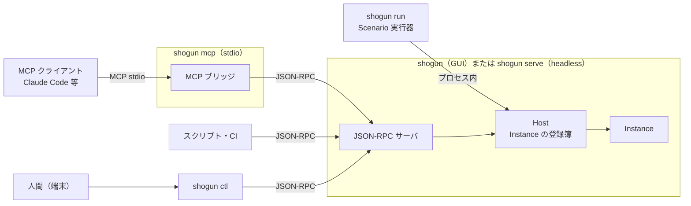
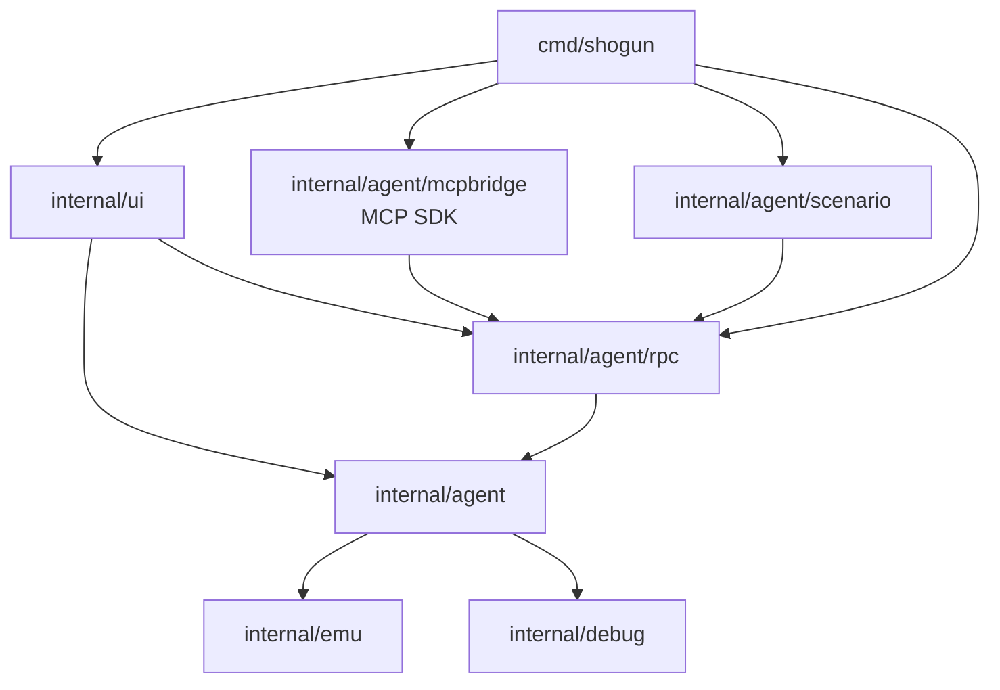

# 14 Agent Interface 設計

- 文書バージョン: 1.0
- 作成日: 2026-10-04
- 対象システム: Shogun Emulator（将軍エミュレータ）

---

## 14.1 目的と範囲

AI エージェントやプログラムからエミュレータを操作・観測・デバッグする窓口（Agent Interface）を設ける。用語は `GLOSSARY.md` に従う。構成の判断は `docs/adr/0001-jsonrpc-core-with-mcp-bridge.md` に記録してある。

用途の優先順位を次に定める。上の用途の要求を優先して設計し、下の用途はその機能を再利用する。

| 優先 | 用途 | 例 |
|---|---|---|
| 1 | AI と共同で開発する | AI が ROM を作り直し、実行し、画面とメモリを観測して不具合を直す |
| 2 | 自動テスト | 「120 フレーム後に Game State の `mode` が `play` になる」を headless で CI 実行する |
| 3 | AI によるゲームプレイ | LLM が Observation を見て入力を決める。Fork で分岐を試す |

範囲外とするものを次に示す。

| 範囲外 | 理由 |
|---|---|
| 市販 ROM のリバースエンジニアリング支援に特化した機能 | 用途の優先順位に含めない。デバッガの機能で足りる範囲は使える |
| 報酬関数とエピソード境界を持つ Gym 互換 API | 用途 3 は Game State・`exec.run_until`・Fork で扱う |
| 強化学習向けの高速化（毎秒数千フレーム） | 現在の lock-step の速度を前提とする |
| 音声波形の観測 | APU レジスタの状態は Machine State として観測できる |
| 組み込みスクリプト言語（Lua・JavaScript） | Scenario（§14.17）で自動化の要求を満たす |
| ROM のビルド | エージェントが自身でビルドコマンドを実行する |

## 14.2 構成

### 14.2.1 Transport

Agent Command の実装は JSON-RPC 層の 1 か所に置く。MCP と CLI はその前段の変換である。



| Transport | 起動 | 接続先 |
|---|---|---|
| JSON-RPC | GUI 版で Agent Interface を有効にしたとき、または `shogun serve` | ローカルソケット（§14.5.1） |
| MCP | `shogun mcp` | 既定はプロセス内に Host を持つ。`--attach` で起動中のプロセスへ JSON-RPC で接続する |
| CLI | `shogun ctl`、`shogun run` | `ctl` は起動中のプロセスへ接続する。`run` はプロセス内に Host を持つ |

`shogun mcp` がプロセス内に Host を持つときも、ブリッジと Host の間は JSON-RPC で話す（`net.Pipe` でつなぐ）。MCP の経路と JSON-RPC の経路で挙動が分かれないようにするためである。`shogun run` も同じく `net.Pipe` を通す。

### 14.2.2 パッケージ

```
internal/agent/              Host、Instance、Control、Agent Command の登録簿、Observation、イベント、Repro と Re-Reach
internal/agent/rpc/          JSON-RPC 2.0 のサーバとクライアント、接続先の発見、トークン
internal/agent/mcpbridge/    MCP ブリッジ。MCP SDK への依存をここに閉じる
internal/agent/scenario/     Scenario の読み込み・実行・JUnit XML 出力
internal/debug/              既存。Symbol の再構成、.dbg の読み込み、Game State、Diagnostic、プロファイル、PPU 書き込み記録を追加する
```

依存方向を次に示す。「01 全体アーキテクチャ設計」§1.4 の図に加える。



| 規則 | 理由 |
|---|---|
| `internal/agent` は `internal/ui` を参照しない | GUI なしで動く headless と同じコードを使うため |
| `internal/agent/mcpbridge` は `internal/agent` を直接参照せず、`rpc` のクライアントだけを使う | MCP の経路が JSON-RPC を迂回しないため |
| MCP SDK を参照するのは `internal/agent/mcpbridge` だけ | SDK の更新の影響を 1 パッケージに閉じる |
| `internal/nes` は Agent Interface のために変更しない。必要な観測は `Hooks` で行う | 「01 全体アーキテクチャ設計」§1.2 の分離を保つ |

これらの規則を `internal/arch` の静的検査に加える。

### 14.2.3 MCP SDK

MCP の実装に公式の Go SDK `github.com/modelcontextprotocol/go-sdk` を用いる。2026-10 時点の最新は v1.8.0 である。実装を始める時点で最新版を確認し、`go.mod` に固定する。

JSON-RPC 層は標準ライブラリ（`encoding/json`・`net`）で実装する。MCP SDK の内部の JSON-RPC 実装は公開 API ではなく、JSON-RPC 層をこれに依存させると SDK の更新で壊れるためである。

### 14.2.4 スレッド

| 主体 | 担当 |
|---|---|
| 受け付けゴルーチン（Transport ごとに 1 本） | 接続を受け付ける |
| 接続ゴルーチン（接続ごとに 1 本） | 要求を読み、Agent Command を実行し、応答を書く |
| 各 Instance のエミュレーションゴルーチン | 既存（「01 全体アーキテクチャ設計」§1.5）。Instance ごとに 1 本 |

Agent Command は Machine State に直接触れない。`emu.Emulator` のコマンドキューと `WithMachine` を通す。エミュレーション状態を触るのはエミュレーションゴルーチンだけという規約（§1.5）は変わらない。

1 つの接続から届いた要求は届いた順に処理する。ただし `exec.cancel` と `events.poll` は先行する要求の完了を待たずに処理する。`exec.run_until` の実行中に止めるためである。`exec.cancel` は、同じ接続からそれより前に受け取った要求を、処理中か順番待ちかによらずすべて取り消す。引数 `id` に JSON-RPC の要求の `id` を渡したときは、その要求だけを取り消す。MCP のキャンセル通知は特定の要求に対するものであり、ブリッジは `id` つきで送る。処理中の要求だけを取り消すと、先行する要求の処理が始まる前に `exec.cancel` が届いたとき、何も止まらないためである。

同じ Instance への進行の要求（§14.7 の分類「進行」）は、接続をまたいで 1 つずつ処理する。Control（§14.4）を持つ接続だけが進行を要求できるため、通常は競合しない。

## 14.3 Instance

### 14.3.1 Host

```go
package agent

type InstanceID string // "i1", "i2", ...

type Host struct {
    mu        sync.Mutex
    instances []*Instance // 作成順。map を使わない（決定論の規約ではないが、一覧の順序を安定させる）
    nextID    int
    shared    []*romShared // ROM ハッシュごとの共有物
    limits    Limits
    gui       bool         // GUI 版の Host か
}

type Instance struct {
    ID       InstanceID
    emu      *emu.Emulator
    control  controlState
    events   *eventQueue  // §14.14
    freezes  []Freeze     // §14.13
    observed map[connID]*observedValues // 前回の観測値（§14.9.2）
    shared   *romShared
}

// romShared は同じ ROM を読み込んだ Instance で共有するもの。
type romShared struct {
    romKey    string
    symbols   *debug.Symbols
    gamestate *debug.GameStateDef
}
```

| Host の種類 | Instance の数 | `instance.create`・`instance.fork`・`instance.close` |
|---|---|---|
| GUI 版 | 表示中の 1 つだけ。ID は常に `i1` | 受け付けない（エラー `unsupported_in_gui`） |
| headless（`shogun serve`・`shogun mcp`・`shogun run`） | 0 個以上。上限は `agent.maxInstances`（既定値 16） | 受け付ける |

headless の Instance はオーディオデバイスを開かず、`NoPacer` で動く（「11 設定と CLI 設計」§11.5.2）。

headless の Instance は利用者のバッテリーバックアップ（`saves/<rom-hash>.sav`）を読み書きしない。Host ごとの一時ディレクトリを保存先とし、Host を閉じるときに消す。読むと結果がセーブデータに依存して再現できなくなり、書くと利用者のセーブデータを上書きするためである。

CHR と PRG のオーバーレイ（`patches/<rom-hash>.json`、「09 デバッガ設計」）は、利用者のものを読むが書き戻さない。Host の一時ディレクトリの `patches/` へ、最初の Instance を作るときに利用者の保存先の中身を写し、それを保存先とする。利用者がオーバーレイを当てて作った状態を AI も同じ画で観測でき、Instance を閉じるときの保存で利用者のファイルを作る・上書きする・消すことがない。

同じ ROM を読み込んだ Instance は、`emu.Config.LoadSymbols` を通して 1 つの `*debug.Symbols` を共有する。別々に読むと、終了時に同じシンボルファイルを互いの内容で上書きし合うためである。現在の `debug.Symbols` はウォッチと保存するブレークポイントも持つ。Instance ごとに分けるのは Symbol の再構成（§14.11、フェーズ 16）で行う。

Agent Command の引数 `instance` を省略したとき、Instance が 1 つだけならそれを対象とする。2 つ以上あるときはエラー `instance_required` を返す。

### 14.3.2 Fork

`instance.fork` は、対象の Instance の現在の Machine State を複製して新しい Instance を作る。

| 対象 | Fork 後 |
|---|---|
| Machine State | 複製する（`SaveState` → 新しい `emu.Emulator` で `LoadState`） |
| ROM の内容とオーバーレイ | 同じ ROM の内容から組み立てる。オーバーレイは複製する |
| Symbol、Game State Definition | **共有する**（`romShared`）。ROM ごとに 1 つ |
| ブレークポイント | Fork した時点の内容を複製し、以降は別々に持つ |
| ウォッチ | ROM ごとのシンボルファイルに保存するため、Symbol と同じく共有する |
| Freeze | 複製する |
| 常時記録（§14.16） | Fork した時点までの記録を複製し、以降は別々に記録する |
| Diagnostic の有効・無効、トレースとプロファイルの設定 | 複製する |
| Control | 新しい Instance の Control は Fork を要求した接続が持つ |
| イベントキュー | 空で始める |

複製は命令境界で行う。命令の途中で止まっている Instance（サイクル単位ステップ中）の Fork は、「08 セーブステートと入力ムービー設計」§8.3.2 と同じく命令を完了させてから行い、その旨を応答の `notes` に含める。

## 14.4 Control と進行モード

### 14.4.1 Control

Control は Instance に入力を与え、進行させる権利である。一度に 1 人（人間または 1 つの接続）だけが持つ。

| 操作 | 動作 |
|---|---|
| `control.acquire` | Control を得る。他の接続が持っているときはエラー `control_held`。人間が持っているときは奪う（GUI に表示する） |
| `control.release` | Control を返す。GUI 版では人間に戻る |
| 接続の切断 | その接続が持っていた Control を返す |
| 人間の取り返し（GUI 版） | ゲームの入力キーを押すか、バナーの「取り返す」を押すと人間に戻る。エージェントへ `control_changed` イベントを送る |

headless の Instance に人間はいない。`instance.create` と `instance.fork` を要求した接続が Control を持った状態で作る。headless の Instance で誰も Control を持っていないとき（持っていた接続が切れた後など）は、進行か書き換えを要求した接続が自動で Control を得る。`shogun ctl` のように要求ごとに接続し直すクライアントが、`control.acquire` を送らずに進められるようにするためである。GUI 版では人間が持っているため、自動では得ない。

### 14.4.2 進行モード

| モード | 進行 | 入力 |
|---|---|---|
| Agent-Paced | エージェントの進行要求（§14.8）の間だけ進む。要求が終わると一時停止する | 進行要求に含めた入力だけを使う。キーボードの入力は使わない |
| Real-Time | 実時間で走る（既存の動作） | キーボード |

エージェントが Control を得ると Agent-Paced になり、Instance は一時停止する。

Agent-Paced の間、フレームの開始時の処理（入力のラッチ、ムービーの記録と再生、巻き戻しの記録）を、そのフレームの最初の命令を実行する直前まで遅らせる。止まっている間に届いた次の進行の要求の入力を、そのフレームの入力としてラッチするためである。遅らせても、ラッチするまでに命令を実行しないため、ムービーのラッチ点（「08 セーブステートと入力ムービー設計」§8.7.1）と同じ状態で行われる。Agent-Paced の Instance でムービーの再生を始めても、一時停止したままとする。人間が取り返すと Real-Time に戻る。取り返す直前に一時停止していたかどうかは保たない。人間が取り返したのは操作したいからであり、走らせて返すのが自然である。

headless の Instance は常に Agent-Paced である。

### 14.4.3 GUI の表示

エージェントが Control を持つ間、GUI 版のメインウィンドウの上端にバナーを出す。

```
[AI が操作中: claude-code（接続 #3）]                         [取り返す]
```

バナーの名前は `session.hello` の `client` の値（§14.5.1）とする。Control を持たない接続が観測しているだけのときはステータスバーに「AI 接続中（2）」と接続数を出す。

## 14.5 Transport

### 14.5.1 JSON-RPC

JSON-RPC 2.0 を用いる。1 行に 1 つのメッセージを書く（改行区切り。メッセージ内に改行を含めない）。`nc` などで手で試せるためである。メッセージの上限を 16 MiB とする。

接続先はローカルソケットとする。

| 方式 | 指定 | 既定 |
|---|---|---|
| Unix ドメインソケット | `unix`（パスは自動で決める） | 3 OS とも既定。Windows は Windows 10 1803 以降が対応する |
| TCP | `tcp:127.0.0.1:PORT`（`PORT` が 0 なら自動で選ぶ） | 使わない。Unix ドメインソケットを使えない環境のための代替 |

TCP で待ち受けるアドレスは `127.0.0.1` と `::1` に限る。それ以外を指定したときは起動を断る。

**接続先の発見**。待ち受けを始めたプロセスは、発見ファイルを書く。

| 項目 | 値 |
|---|---|
| 場所 | キャッシュディレクトリ（「11 設定と CLI 設計」§11.2）の `agent/<pid>.json` |
| パーミッション | 0600（Windows は所有者だけに読み書きを許す ACL） |
| 内容 | `pid`・`endpoint`（`unix:/path` または `tcp:127.0.0.1:PORT`）・`token`・`kind`（`gui` または `serve`）・`rom`（読み込み中の ROM 名）・`started`（RFC 3339） |
| 削除 | 正常終了時に消す。クライアントは `pid` のプロセスが無いファイルを古いものとして無視し、消す |

Unix ドメインソケットのパスも同じ `agent/` に `<pid>.sock` として置く。macOS のソケットパスの上限（104 バイト）に収まるよう、キャッシュディレクトリを使う。

**認証**。待ち受けを始めるとき、32 バイトの乱数から 16 進 64 文字のトークンを作る。接続した側は最初に `session.hello` を送り、`token` を渡す。それより前の要求と、トークンが一致しない `session.hello` にはエラー `unauthorized` を返して接続を切る。Unix ドメインソケットでもトークンを要求する。方式によって認証の有無が変わると、TCP へ切り替えたときに穴が開くためである。

```json
→ {"jsonrpc":"2.0","id":1,"method":"session.hello","params":{"token":"…","client":"claude-code","api_version":1}}
← {"jsonrpc":"2.0","id":1,"result":{"api_version":1,"server":"shogun 1.1.0","kind":"gui","instances":["i1"]}}
```

`api_version` は Agent Interface の版である。この文書が定めるのは 1 とする。互換でない変更をしたときに上げる。

**エラー**。JSON-RPC の標準のエラーコードに加え、次を用いる。`error.data.kind` に下表の名前を入れる。

| コード | `kind` | 意味 |
|---|---|---|
| -32001 | `unauthorized` | `session.hello` の前の要求、またはトークン不一致 |
| -32002 | `control_required` | Control を持たない接続が進行・書き込みを要求した |
| -32003 | `control_held` | 他の接続が Control を持っている |
| -32004 | `instance_not_found` | 指定した Instance が無い |
| -32005 | `instance_required` | Instance が 2 つ以上あり、`instance` を省略した |
| -32006 | `not_loaded` | ROM が読み込まれていない |
| -32007 | `invalid_location` | アドレスの指定（§14.6）を解決できない |
| -32008 | `invalid_expression` | 式の構文エラー。`error.data.position` に位置を入れる |
| -32009 | `unsupported_in_gui` | GUI 版では受け付けない操作 |
| -32010 | `limit_exceeded` | Instance 数などの上限 |
| -32011 | `cancelled` | `exec.cancel` で止めた |
| -32012 | `movie_conflict` | ムービーの再生中で受け付けられない |
| -32013 | `io_error` | ファイルの読み書きに失敗した |
| -32014 | `unsupported_in_headless` | headless では受け付けない操作（`exec.run`・`exec.pause`） |

JSON-RPC のバッチ要求（配列で送る要求）は受け付けず、`-32600`（Invalid Request）を返す。複数の操作をまとめる手段は `exec.input_sequence` と Scenario で足り、バッチの中に進行と観測が混ざったときの順序の規則を持ち込まないためである。

**通知**。サーバからクライアントへの通知（`id` を持たないメッセージ）は `events.subscribe` を送った接続にだけ送る（§14.14）。

### 14.5.2 MCP ブリッジ

```
shogun mcp [--attach [PID]] [--rom PATH] [ほかの headless 向けオプション]
```

| 指定 | 動作 |
|---|---|
| なし | プロセス内に headless の Host を持つ。`--rom` があれば Instance を 1 つ作って読み込む |
| `--attach` | 発見ファイル（§14.5.1）から起動中のプロセスを選んで接続する。複数あるときは `kind` が `gui` で最も新しいもの |
| `--attach PID` | 指定したプロセスへ接続する |

MCP の Transport は stdio とする。Claude Code などのクライアントの設定に `shogun mcp` を書くだけで使えるようにするためである。

Agent Command を MCP のツールとして公開する。名前の変換は §14.5.4、引数の JSON Schema は Agent Command の登録簿（§14.7.1）から生成する。

| Agent Command の結果 | MCP の結果 |
|---|---|
| JSON の値 | `TextContent` に JSON を入れる。加えて `structuredContent` にも入れる |
| 画像（Observation の `image`、`obs.screenshot`） | `ImageContent`（`image/png`） |
| エラー | `isError: true` の結果。`TextContent` に `kind` と説明を入れる |

MCP のキャンセル通知（`notifications/cancelled`）を受けたら、対応する要求について `exec.cancel`（`id` つき）を送り、止まった位置の結果を返す。

`session.hello`（ブリッジが接続のときに済ませる）と `events.subscribe`・`events.unsubscribe`（通知を受け取る接続のためのもの）はツールにしない。接続先の Host の種類で使えない Agent Command（GUI 版の `instance.create`、headless の `exec.run` など）もツールにしない。

画像を `ImageContent` に移したとき、`TextContent` と `structuredContent` の JSON の画像の値は `{"mime": "image/png", "bytes": <大きさ>, "content_index": <ImageContent の番号>}` に置き換える。

MCP の `instructions` に、使い方の要約（観測のループ、画像は必要なときだけ求めること、位置と式の書き方）を英語で入れる。

MCP のツールの説明文は Agent Command の登録簿に日本語と英語で持ち、MCP には英語を渡す。LLM が多言語の説明より英語の説明でツールを選ぶ精度が高いためである。

### 14.5.3 CLI

```
shogun serve [--listen unix|tcp:127.0.0.1:PORT]
shogun ctl [--pid PID] <名前空間> <操作> [引数...]
shogun run <Scenario ファイル...> [--junit PATH] [--update-golden] [--repro-dir DIR]
```

`shogun ctl` 自身のオプション（`--pid`・`--text`・`--out`・`--json`・`--config`・`--portable`）は名前空間より前に書く。名前空間より後ろの `--name` はすべて Agent Command の引数として扱う。引数の型は登録簿の JSON Schema に従って変換し、スキーマに無い引数だけを見た目で判断する。

`shogun` の第 1 引数が `serve`・`mcp`・`ctl`・`run` のどれかのとき、サブコマンドとして扱う。同じ名前の ROM を開くときは `./serve` のようにパスで渡す。

`shogun ctl` の引数は次のとおり JSON-RPC の `params` に変換する。

| 書き方 | `params` |
|---|---|
| `--frames 60` | `{"frames": 60}`（数値に見えるものは数値、`true`/`false` は真偽値） |
| `--input R+A` | `{"input": "R+A"}` |
| `--json '{"steps":[…]}'` | 渡した JSON をそのまま使う。他の引数と併用したときは他の引数で上書きする |
| 位置引数 | 操作ごとに登録簿で定めた順の引数に入れる（例: `shogun ctl mem read player_x 4` → `{"loc":"player_x","length":4}`） |

出力は既定で整形した JSON とする。`--text` で人が読む形にする。画像は `--out PATH` を指定したときだけファイルに書き、指定がなければ大きさだけ表示する。

`shogun ctl events watch` は `events.subscribe` を送り、届いた通知を 1 行ずつ表示し続ける。

`shogun run` は Scenario（§14.17）を実行する。

### 14.5.4 名前の変換

| Transport | 形 | 例 |
|---|---|---|
| JSON-RPC | ドット区切り | `exec.run_until`、`debug.bp.add` |
| MCP | ドットをアンダースコアに置き換える | `exec_run_until`、`debug_bp_add` |
| CLI | ドットを空白に置き換え、アンダースコアをハイフンに置き換える | `shogun ctl exec run-until`、`shogun ctl debug bp add` |
| Scenario | JSON-RPC と同じ | `exec.run_until:` |

Agent Command の名前は小文字の英字・数字・アンダースコア・ドットだけで作る。変換が機械的に往復できるようにするためである。

## 14.6 アドレスと値の指定

Agent Command でメモリの位置を受け取る引数（`loc`）は、すべて次の書き方を受け付ける。

| 書き方 | 意味 |
|---|---|
| `$0300`、`0x0300`、`768` | CPU アドレス |
| `player_x` | Symbol の名前。Symbol の位置に解決する |
| `bank3:$8123` | PRG-ROM のバンク 3（8 KiB 単位）で CPU アドレス `$8123` に当たる位置 |
| `prg:$1A123` | PRG-ROM のファイルオフセット（ヘッダを除く） |
| `chr:$0123`、`ppu:$2000`、`oam:$10`、`pal:$03` | 各空間のアドレス（「09 デバッガ設計」§9.4.5 の空間） |
| `enemies+2*4` | 式。Symbol・数値・`+ - * / & \| << >>` と括弧 |
| `[ptr]` | 間接参照。`ptr` の位置から 2 バイト（リトルエンディアン）を読み、それを CPU アドレスとする |

空間の接頭辞（`ppu:` など）を持たない位置は CPU アドレス空間とする。

`bankN:` のバンクの大きさは 8 KiB に統一する。マッパーごとに切り替えの単位（16 KiB・32 KiB）が異なっても、利用者がマッパーを意識せずに書けるようにするためである。`bankN:$ADDR` は PRG-ROM のオフセット `N * 0x2000 + (ADDR & 0x1FFF)` を表す。

CPU アドレスが `$8000`–`$FFFF` の位置を読むときは、現在のバンク構成で見える値を読む。`bankN:` や `prg:` で指定したときは、現在そのバンクが見えていなくても PRG-ROM から直接読む。

値（`value`）の引数は、数値（`$42`・`42`・`%0100_0010`）、Game State の列挙名（`"play"`）、バイト列（`[1, 2, $FF]`）を受け付ける。

位置と式の解析は、既存の条件式（「09 デバッガ設計」§9.6.1）の字句解析と構文解析を拡張して共有する（§14.11.4）。

## 14.7 Agent Command

### 14.7.1 登録簿

Agent Command は 1 か所の登録簿で定義する。登録簿から JSON-RPC の振り分け、MCP のツール定義、CLI のヘルプ、Scenario の検証を作る。

```go
package agent

type CommandSpec struct {
    Name        string         // "exec.run_until"
    Class       CommandClass   // 下の分類
    Params      any            // 引数の構造体の零値。JSON Schema の生成に使う
    Positional  []string       // CLI の位置引数の順
    DescJA      string
    DescEN      string
    GUI         bool           // GUI 版の Host で受け付けるか
    Headless    bool           // headless の Host で受け付けるか
    Target      bool           // 引数 instance で対象の Instance を選ぶか
    Handler     func(ctx *Context, params json.RawMessage) (any, error)
}

type CommandClass uint8

const (
    ClassObserve CommandClass = iota // 観測。Control 不要。Machine State を変えない
    ClassConfig                      // デバッグ設定（ブレークポイント、Game State Definition など）。Control 不要
    ClassAdvance                     // 進行。Control が必要
    ClassMutate                      // Machine State の書き換え、ROM・ステートの読み込み。Control が必要
    ClassSession                     // 接続と Instance の管理
)
```

ブレークポイントの追加を Control 不要（`ClassConfig`）とするのは、人間が遊んでいる GUI にエージェントが観測目的でブレークポイントを置く使い方があるためである。ブレークポイントで止まると人間の操作も止まるため、GUI 版でエージェントが Control を持たずにブレークポイントを追加したときは、GUI のステータスバーに「AI がブレークポイントを追加」と出す。

### 14.7.2 一覧

| 名前 | 分類 | 内容 |
|---|---|---|
| **session** | | |
| `session.hello` | Session | 認証と版の確認（§14.5.1） |
| `session.commands` | Session | Agent Command の一覧と引数のスキーマを返す。スキーマは JSON Schema のまま返し、MCP ブリッジがツール定義にそのまま使う |
| **instance** | | |
| `instance.list` | Session | Instance の一覧（ID、ROM、フレーム番号、Control の持ち主、進行モード） |
| `instance.create` | Session | 新しい Instance を作る。引数 `rom`・`state`・`deterministic`・`ram_init`・`ram_seed` |
| `instance.fork` | Session | Fork する（§14.3.2） |
| `instance.close` | Session | Instance を閉じる |
| **control** | | |
| `control.acquire` / `control.release` / `control.status` | Session | §14.4 |
| **exec** | | |
| `exec.step` | Advance | 入力を押したまま N フレーム進める（§14.8.1） |
| `exec.input_sequence` | Advance | 入力の列を流す（§14.8.2） |
| `exec.run_until` | Advance | 条件が成り立つまで進める（§14.8.3） |
| `exec.step_unit` | Advance | サイクル・命令・オーバー・アウト・スキャンライン単位で進める（「09 デバッガ設計」§9.5）。オーバー・アウト・スキャンラインは `count` の回数だけ繰り返し、途中で止まったらそこで終える。`to` で指定位置まで |
| `exec.reset` | Advance | リセット。`hard: true` で電源の入れ直し |
| `exec.cancel` | Session | 実行中の進行要求を止める |
| `exec.run` / `exec.pause` | Advance | GUI 版で Control を持ったまま Real-Time で走らせる・止める。ゲームの様子を人間に見せるため。headless では `unsupported_in_headless` |
| **obs** | | |
| `obs.get` | Observe | Observation を返す（§14.9）。`include` で付ける内容を選ぶ |
| `obs.screenshot` | Observe | 現在の画面の PNG。`scale` 1–4 |
| `obs.sprites` | Observe | スプライト一覧（§14.10.1） |
| `obs.nametable` | Observe | ネームテーブルの格子（§14.10.2） |
| `obs.patterns` | Observe | パターンテーブル（§14.10.3） |
| `obs.palette` | Observe | パレット（§14.10.4） |
| `obs.ppu_writes` | Observe | 直前のフレームの PPU レジスタ書き込みの記録（§14.10.5） |
| `obs.apu` | Observe | APU の状態（「05 APU 設計」§5.9 の `Inspect`） |
| **mem** | | |
| `mem.read` | Observe | `loc` から `length` バイトを副作用なしに読む |
| `mem.write` | Mutate | 書く。`side_effects: true` で `Bus.Write` を使う（「09 デバッガ設計」§9.4.5） |
| `mem.find` | Observe | バイト列を探す。`space`（`cpu`・`ram`・`ppu`・`oam`・`prg`・`chr`・`prgram`）で空間を選ぶ。最大 100 件 |
| `mem.freeze` / `mem.unfreeze` / `mem.freezes` | Mutate / Mutate / Observe | Freeze（§14.13.2） |
| **cpu** | | |
| `cpu.get` | Observe | レジスタ、PPU の位置、保留中の割り込み |
| `cpu.set` | Mutate | レジスタを書き換える。命令の途中で止まっているときは断る |
| `cpu.disasm` | Observe | 逆アセンブル。Symbol と元のソース行（§14.11.3）を添える |
| `cpu.callstack` | Observe | コールスタック（推定）。記録は CPU デバッガの機能の一部であり、初めて要求されたときに有効にして、その旨を `notes` に入れる |
| `expr.eval` | Observe | §14.11.4 の式を評価し、値と真偽を返す（§14.11.4） |
| **symbol** | | |
| `symbol.load` | Config | Symbol を読み込む（§14.11.2） |
| `symbol.lookup` | Observe | 名前から位置、位置から名前とソース行を引く |
| `symbol.list` | Observe | 名前で絞り込んだ一覧 |
| `symbol.set` / `symbol.remove` | Config | 利用者の Symbol を付ける・外す |
| **gamestate** | | |
| `gamestate.get` | Observe | Game State の値。`names` を省略するとすべて |
| `gamestate.define` / `gamestate.remove` | Config | Game State Definition の項目を足す・消す（§14.12） |
| `gamestate.list` | Observe | 定義の一覧 |
| `gamestate.save` | Config | 定義をファイルに書く |
| `gamestate.load` | Config | 定義をファイルから読み込み、今の定義と置き換える（§14.12.3） |
| **debug** | | |
| `debug.bp.add` / `debug.bp.remove` / `debug.bp.list` / `debug.bp.enable` | Config / Config / Observe / Config | ブレークポイント（「09 デバッガ設計」§9.6）。位置は §14.6 の書き方 |
| `debug.watch.add` / `debug.watch.remove` / `debug.watch.list` | Config / Config / Observe | ウォッチ。Observation に値を含める |
| **trace** | | |
| `trace.enable` / `trace.disable` | Config | トレースのリングバッファを有効にする |
| `trace.query` | Observe | 絞り込んで取り出す（§14.18.1） |
| `trace.summary` | Observe | 要約（§14.18.2） |
| **profile** | | |
| `profile.start` / `profile.stop` / `profile.report` | Config / Config / Observe | プロファイル（§14.19） |
| **diag** | | |
| `diag.configure` | Config | Diagnostic の項目ごとの有効・無効（§14.20） |
| `diag.list` | Observe | 検知した Diagnostic の一覧 |
| **state** | | |
| `state.save` | Observe | セーブステートを作る。`path` を省略すると Instance 内の名前付きの保管場所に置く |
| `state.load` | Mutate | セーブステートを読み込む |
| `state.list` | Observe | 名前付きの保管場所の一覧 |
| **rom** | | |
| `rom.load` | Mutate | ROM を読み込む |
| `rom.reload` | Mutate | 同じパスから読み直す。`re_reach` を指定できる（§14.15） |
| `rom.watch` | Config | ROM ファイルの監視を切り替える（§14.15.2） |
| **record** | | |
| `record.status` | Observe | 常時記録の状態（開始方法、フレーム数、介入の数） |
| `repro.export` | Observe | Repro を書き出す（§14.16.3） |
| `scenario.export` | Observe | この Instance で実行した Agent Command を Scenario として書き出す（§14.17.4） |
| `scenario.mark` | Config | `scenario.export` の書き出しを始める位置に印を付ける（§14.17.4） |
| **events** | | |
| `events.poll` | Observe | イベントを取り出す（§14.14） |
| `events.subscribe` / `events.unsubscribe` | Session | 通知の購読（JSON-RPC と CLI のみ） |

各 Agent Command の引数と結果の詳細は登録簿の構造体で定める。この文書では進行（§14.8）と観測（§14.9–§14.10）の形を定める。

### 14.7.3 ムービーとの関係

Instance が入力ムービー（`--movie` や GUI からの再生）を再生している間は、`ClassAdvance` の `exec.step` の入力指定と `ClassMutate` を断る（`movie_conflict`）。入力がムービーで決まっているためである。進行（入力の指定なし）と観測はできる。

## 14.8 進行

進行の要求は、Instance を一時停止した状態から始め、終わると一時停止した状態に戻す。応答は進行が終わってから返す。応答には `stop_reason`（§14.8.4）と Observation（§14.9）を含める。

### 14.8.1 exec.step

```json
{"frames": 60, "input": "R", "observe": {"include": ["image"]}}
```

| 引数 | 既定 | 内容 |
|---|---|---|
| `frames` | 1 | 進めるフレーム数。1–36000 |
| `input` | `""` | ポート 1 の入力。§14.8.5 の書き方 |
| `input2` | `""` | ポート 2 の入力 |
| `observe` | 既定の Observation | §14.9.3 |
| `break` | `true` | ブレークポイント・Diagnostic で止まるか |

フレームの数え方は「ムービーのフレーム」と同じとする（「08 セーブステートと入力ムービー設計」§8.7.1）。`frames: 1` は次のフレームの開始（scanline 0 / dot 0 を過ぎた最初の命令境界）まで進める。入力はそのフレームの開始時にラッチされる。

### 14.8.2 exec.input_sequence

```json
{"steps": [
  {"frames": 10, "input": "R"},
  {"frames": 1,  "input": "R+A"},
  {"frames": 30, "input": "R"}
], "observe_each": false}
```

列を順に流す。途中でブレークポイントや Diagnostic で止まったときはそこで終え、`completed_steps` に流し終えた数を入れる。`observe_each: true` のとき、各要素の終わりの要約（§14.9.1 のうち画像を除く）を `per_step` に並べる。

### 14.8.3 exec.run_until

```json
{"condition": "game.mode == 'play' || [lives] == 0", "max_frames": 600, "input": "", "check": "frame"}
```

| 引数 | 既定 | 内容 |
|---|---|---|
| `condition` | 必須 | §14.11.4 の式 |
| `max_frames` | 600 | 上限。1–216000（1 時間） |
| `check` | `frame` | 判定の頻度。`frame`（フレームの開始ごと）または `instruction`（命令境界ごと） |
| `input`・`input2` | `""` | 進める間押し続ける入力 |
| `timeout_ms` | なし | 実時間の上限。到達すると `stop_reason: timeout` |

`check: instruction` は命令境界ごとに判定する。遅いため、必要なときだけ使う。条件式はフェーズ 15 の時点では既存の条件式（「09 デバッガ設計」§9.6.1）の文法で、§14.11.4 の拡張はフェーズ 16 で加える。

`timeout_ms` で止まった位置は実行環境の速さで変わる。決定論が必要な用途（Scenario）では使わない。Scenario の検証で `timeout_ms` を見つけたら警告する。

### 14.8.4 Stop Reason

| `stop_reason` | 意味 | 添える情報 |
|---|---|---|
| `frames_done` | 指定したフレーム数を進めた | |
| `sequence_done` | 入力の列を流し終えた | |
| `condition` | `run_until` の条件が成り立った | 成り立った式 |
| `max_frames` | `run_until` の上限に達した | |
| `breakpoint` | ブレークポイントで止まった | ブレークポイントの ID と種別、位置 |
| `diagnostic` | 停止を指定した Diagnostic を検知した | Diagnostic（§14.20） |
| `step_done` | `exec.step_unit` を終えた | |
| `cancelled` | `exec.cancel` で止めた | |
| `timeout` | `timeout_ms` に達した | |
| `control_lost` | 進行中に人間が Control を取り返した | |
| `cpu_halted` | STP などで CPU が止まった | |

### 14.8.5 入力の書き方

| 書き方 | 意味 |
|---|---|
| `""` | 何も押さない |
| `A`、`B`、`Select`、`Start`、`Up`、`Down`、`Left`、`Right` | 各ボタン |
| `U`、`D`、`L`、`R` | 方向の略記 |
| `R+A`、`Up+B+A` | 同時押し。`+` でつなぐ |
| `$81` | ビットマスク（bit 0 から A・B・Select・Start・Up・Down・Left・Right。「07 入力設計」の並び） |

大文字・小文字を区別しない。上下または左右の同時押しは、そのまま渡す（実機で可能なため）。ただしキーボード入力の設定 `input.allowOpposingDirections` には従わない。エージェントは意図して同時押しを試すことがあるためである。

## 14.9 Observation

### 14.9.1 要約

進行の応答と `obs.get` は既定で次の要約を返す。

```json
{
  "instance": "i1",
  "frame": 1840,
  "stop_reason": "condition",
  "stop_detail": {"expr": "game.mode == 'play'"},
  "cpu": {"pc": "$C123", "symbol": "main_loop+3", "source": "src/main.s:120", "mid_instruction": false},
  "gamestate_changed": {"mode": {"from": "title", "to": "play"}, "player_x": {"from": 0, "to": 32}},
  "watch": {"$0300": 32, "enemy_count": 3},
  "diagnostics": [{"kind": "vram_access_during_render", "count": 2, "first": {"frame": 1838, "scanline": 120, "pc": "$C340", "symbol": "draw_hud"}}],
  "events_pending": 0,
  "notes": []
}
```

| フィールド | 内容 |
|---|---|
| `frame` | ムービーのフレーム番号と同じ数え方のフレーム番号 |
| `cpu` | PC と、それに当たる Symbol とソース行。命令の途中で止まっていれば `mid_instruction: true` |
| `gamestate_changed` | §14.9.2 の差分 |
| `watch` | ウォッチの現在値。ウォッチが 1 つも無ければ省く |
| `watch_changed` | ウォッチの値の前回からの差分（§14.9.2 と同じ規則）。変化が無ければ省く |
| `diagnostics` | 前回の Observation 以降に検知した Diagnostic を種類ごとにまとめたもの。無ければ省く |
| `events_pending` | イベントキューに残っている数 |
| `notes` | 補足（命令を完了させてから保存した、など） |

### 14.9.2 差分

Game State の値は、**同じ接続が同じ Instance について前回受け取った Observation** からの差分で返す。初めての Observation ではすべての値を `{"from": null, "to": …}` で返す。`obs.get` に `full: true` を渡すと、差分ではなく全項目の現在値を `gamestate` に入れて返す。

差分を接続ごとに持つのは、別のクライアント（人間の `shogun ctl` など）が観測しただけで、エージェントの見る差分が消えることを防ぐためである。

### 14.9.3 付ける内容の選択

`observe.include` で次を付けられる。

| 名前 | 内容 |
|---|---|
| `image` | 画面の PNG。`observe.scale` で 1–4 倍（既定 2） |
| `gamestate` | Game State の全項目の現在値 |
| `cpu_full` | レジスタ・スタック・保留中の割り込み（`cpu.get` の結果） |
| `sprites` | §14.10.1 |
| `nametable` | §14.10.2 のうち、表示中の画面に当たる 32×30 の範囲 |
| `ppu_writes` | §14.10.5 |

`observe: false` を渡すと要約も付けず、`frame` と `stop_reason` だけを返す。

画像の既定の拡大率を 2 倍とするのは、256×240 のままでは LLM の画像認識で 8×8 のタイルが判別しにくいためである。

## 14.10 構造化された観測

画面を画像で見るだけでは、LLM はピクセルの位置と色を誤って読む。PPU の状態を数値と格子で渡す。

### 14.10.1 スプライト一覧

```json
{"size": "8x8", "sprites": [
  {"index": 0, "x": 120, "y": 87, "tile": "$21", "palette": 0, "priority": "front", "flip_h": false, "flip_v": false, "sprite0": true, "drawn": true}
], "lines_over_8": [96, 97]}
```

`y` は OAM の値（表示位置より 1 小さい）をそのまま返し、表示位置を `screen_y` に添える。Y が `$EF` 以上で画面外のスプライトは既定で省き、`hidden_count` に数を入れる。`all: true` で 64 個すべてを返す。`drawn` と `lines_over_8` は「09 デバッガ設計」§9.4.3 の情報と同じものである。

### 14.10.2 ネームテーブル

```json
{"table": 0, "base": "$2000", "mirroring": "vertical",
 "tiles": ["00 00 00 24 24 …", "…"],
 "attributes": ["0 0 1 1 …", "…"],
 "scroll": {"x": 0, "y": 0, "nametable": 0}}
```

`tiles` は 30 行で、各行はタイル番号 32 個を 16 進 2 桁と空白で並べた文字列とする。`attributes` は 15 行で、各行は 16×16 ピクセルの区画ごとのパレット番号 16 個とする。JSON の配列の配列にしないのは、LLM が格子として読みやすく、トークンも少ないためである。

`table` を省略すると、フレームの開始時のスクロール位置から見える範囲（2 面にまたがる場合はつないだもの）を返す。フレームの途中でスクロールを変えるプログラムでは、上端の位置だけを反映する。その旨を `notes` に入れ、§14.10.5 の書き込み記録を見るよう促す。

### 14.10.3 パターンテーブル

| 引数 | 内容 |
|---|---|
| `format: "hash"`（既定） | 256 タイル × 2 面のそれぞれの 16 バイトの SHA-1 先頭 8 桁。空白のタイル（全 0）は `null` |
| `format: "image"` | 2 面を並べた PNG。`palette` で適用するパレットを選ぶ |
| `format: "pixels"` | `tiles` で指定したタイルの 8×8 の色番号（0–3）を 8 行の文字列で |

`hash` は、どのタイルが変わったか（CHR のバンク切り替えや CHR-RAM の書き換え）を比べるために使う。

### 14.10.4 パレット

パレット RAM 32 バイトを背景 4 組とスプライト 4 組に分けて返す。各エントリに NES の色番号と、現在の表示パレットでの RGB を添える。

### 14.10.5 PPU 書き込みの記録

直前に完成したフレームの間に行われた、次のレジスタへの書き込みを時刻つきで返す。

| 対象 |
|---|
| `$2000`（PPUCTRL）、`$2001`（PPUMASK）、`$2003`（OAMADDR）、`$2005`（PPUSCROLL）、`$2006`（PPUADDR）、`$4014`（OAMDMA） |

```json
{"frame": 1839, "writes": [
  {"reg": "$2000", "value": "$88", "scanline": 241, "dot": 12, "pc": "$C012", "symbol": "nmi+4"},
  {"reg": "$2005", "value": "$40", "scanline": 31,  "dot": 260, "pc": "$C230", "symbol": "split_scroll+6"}
], "truncated": false}
```

`$2007` は記録しない。1 フレームに数百回書かれることがあり、他の記録を埋めるためである。`$2007` の書き込みの時期の問題は Diagnostic（§14.20）で扱う。

記録は 1 フレームにつき 512 件までとし、超えたら `truncated: true` にする。

記録には `OnCPUWrite` フックを使う。いずれかの接続が `obs.ppu_writes` を要求するか、`observe.include` に `ppu_writes` を含めた時点から有効にし、最後の要求から 600 フレームたっても要求が無ければ無効に戻す。使わないときにフックを `nil` に保つためである（「09 デバッガ設計」§9.6）。有効にした直後のフレームは記録が不完全なので、`complete: false` を返す。

## 14.11 Symbol

### 14.11.1 位置の識別

Symbol の位置を空間とオフセットの組で持つ。

```go
package debug

type SymbolSpace uint8

const (
    SymSpaceCPU    SymbolSpace = iota // $0000–$7FFF の CPU アドレス（内蔵 RAM、レジスタ、PRG-RAM）
    SymSpacePRG                       // PRG-ROM のファイルオフセット
    SymSpacePRGAny                    // $8000–$FFFF の CPU アドレスで、バンクを問わないもの
)

type SymbolLoc struct {
    Space  SymbolSpace
    Offset uint32
}

type Symbol struct {
    Name   string
    Loc    SymbolLoc
    Size   uint16     // バイト数。不明なら 0
    Kind   SymbolKind // label・variable・constant
    Source SourceRef  // 定義のソース位置。不明なら空
    Origin SymbolOrigin // dbg・user・legacy
    Value  int64        // 定数（constant）の値
    CPU    uint16       // PRG-ROM の Symbol の CPU アドレス（リンクしたときの位置）
}
```

| 位置 | 空間 | 理由 |
|---|---|---|
| `$0000`–`$7FFF` | `SymSpaceCPU` | バンク切り替えの対象外（PRG-RAM のバンク切り替えを持つマッパーは対象に含めない） |
| `$8000`–`$FFFF` | `SymSpacePRG` | 同じ CPU アドレスが複数のバンクを指すため |

空間の型の名前を `SymSpace…` とするのは、メモリの空間 `debug.Space`（`SpaceCPU` など）と区別するためである。

CPU アドレスから名前を引くときは、現在のバンク構成でその CPU アドレスを PRG-ROM のオフセットに直し、`SymSpacePRG` の Symbol を探す。見つからなければ `SymSpacePRGAny` を探す。同じ位置に複数の名前があるときは、利用者の付けたもの（`user`）、移したもの（`legacy`）、`.dbg` の順に優先する。

`Symbol.CPU` は、PRG-ROM の Symbol を実行ブレークポイントや `exec.step_unit` の `to` のように CPU アドレスが要る用途に使うときの CPU アドレスである。`.dbg` の `val` から取る。ブレークポイントはバンクを区別せず、この CPU アドレスで止まる。

`.dbg` と Game State Definition の読み込みは、ROM ごとの Symbols（同じ ROM の Instance が共有する）につき 1 回だけ行う。2 つ目の Instance や Fork の読み込みで読み直すと、実行中に `gamestate.define` で足した項目が消えるためである。読み直しは `rom.reload`（§14.15.1）で行う。

ウォッチは ROM ごとのシンボルファイルに保存するため、ROM ごとに共有する（§14.3.2 の表の「ウォッチ」は Fork の時点の内容を複製せず、共有する）。

**既存のシンボルファイルの移行**。現在の `symbols/<rom-hash>.json`（形式のバージョン 1）はラベルを CPU アドレスで持つ。バージョン 2 では次のとおり移す。

| バージョン 1 のラベル | バージョン 2 |
|---|---|
| `$0000`–`$7FFF` | `SymSpaceCPU` |
| `$8000`–`$FFFF` | `SymSpacePRGAny`（`Origin: legacy`）。どのバンクの位置か分からないため |

ウォッチもバージョン 2 では `SymbolLoc` で持つ。GUI で `$8000` 以上の位置に名前を付けるときは、現在見えているバンクの `SymSpacePRG` で保存する。

### 14.11.2 読み込む形式

| 形式 | 拡張子 | 内容 |
|---|---|---|
| ca65/ld65 のデバッグ情報 | `.dbg` | シンボル、型、サイズ、セグメント、ソースファイル、行とアドレスの対応 |
| Shogun のシンボルファイル | `.json` | 「09 デバッガ設計」§9.9 のファイル（バージョン 1・2） |

asm6・NESASM などの形式は扱わない。

`.dbg` は `ld65 --dbgfile` が出力するテキスト形式である。次の行の種類を読む。それ以外の種類の行は読み飛ばす。

| 行 | 使う項目 |
|---|---|
| `file` | `id`、`name` |
| `seg` | `id`、`name`、`start`、`size`、`type`（ro / rw）、`ooffs`（出力ファイルでのオフセット） |
| `span` | `id`、`seg`、`start`、`size` |
| `line` | `file`、`line`、`span` |
| `sym` | `name`、`addrsize`、`size`、`type`（`lab` / `equ` / `imp`）、`val`、`seg` |
| `scope` | `name`、`parent`（ローカルラベルの修飾名 `scope::name` を作る） |

PRG-ROM 上の Symbol のオフセットは、`sym` の `seg` が持つ `ooffs`（出力ファイルでのオフセット）から iNES ヘッダの 16 バイトを引き、セグメント内の位置を足して求める。CPU アドレス（`val`）からは求めない。同じ CPU アドレスに複数のバンクが置かれるためである。`ooffs` を持たないセグメント（RAM 上の `bss` や `zeropage`）の Symbol は `SymSpaceCPU` とする。

**自動の読み込み**。ROM を読み込んだとき、ROM と同じディレクトリに拡張子を `.dbg` に変えたファイルがあれば読み込む。ROM の更新時刻より古い `.dbg` は読み込まず、`notes` で知らせる。ビルドの失敗で古いデバッグ情報が残っている場合に、誤った位置を示すことを防ぐためである。

`.dbg` から読んだ Symbol はファイルに保存しない（ROM を読み込むたびに読み直す）。利用者が付けた Symbol（`Origin: user`）と、バージョン 1 から移した Symbol（`Origin: legacy`）だけを `symbols/<rom-hash>.json` に保存する（形式は「09 デバッガ設計」§9.9）。

### 14.11.3 ソース行

`.dbg` の `line` と `span` から、PRG-ROM のオフセットとソースの位置（ファイル名と行番号）の対応表を作る。`cpu.disasm`、Observation の `cpu.source`、`trace.query`、Diagnostic の位置に、ソースの位置を添える。

マクロの展開による同じ位置への複数の行の対応は、`line` の `type` がマクロでないもの（ソースそのもの）を優先する。

### 14.11.4 式の拡張

既存の条件式（「09 デバッガ設計」§9.6.1）を次のとおり拡張し、ブレークポイントの条件・`exec.run_until`・Scenario のアサーション・位置の指定（§14.6）で共有する。

| 追加する要素 | 記法 | 意味 |
|---|---|---|
| Symbol | `player_x`、`scope::name` | 位置の式では位置。値の式では、RAM 側（`$0000`–`$7FFF`）の名前は `[player_x]` と同じ（1 バイトを読む）、ROM 側の名前（コードのラベル）はその CPU アドレス、定数はその値。`PC == update_mode` のように、コードのラベルはアドレスとして比べることが多いためである |
| サイズを指定した読み出し | `[player_x].w`、`[score].b3` | 2 バイト（リトルエンディアン）、3 バイト |
| Game State | `game.player_x`、`game.mode == 'play'` | Game State の値（§14.12）。列挙は名前で比べる |
| 文字列 | `'play'` | 列挙の名前との比較だけに使う |
| 算術 | `+ - * / % & \| ^ << >> ~` | 整数（64 bit 符号付き）。値の範囲を超えても切り詰めない |
| 実行の位置 | `frame`、`scanline`、`dot`、`cycles` | 現在の位置 |
| 空間を指定した読み出し | `[ppu:$2000]`、`[oam:$00]` | §14.6 の空間 |

0 による除算と剰余は、条件の式（真偽を求める式）では式全体を偽とし、値の式では 0 とする。エラーで止めると、条件付きブレークポイントの評価がエミュレーションの途中で失敗するためである。

名前の綴りがレジスタ（`A`・`X`・`Y`・`S`・`P`・`PC`）、フラグ（`C`・`Z`・`I`・`D`・`V`・`N`）、実行の位置（`frame`・`scanline`・`dot`・`cycles`）と同じとき（大文字・小文字を区別しない）は、レジスタ・フラグ・実行の位置として読む。既存の条件式で `pc` などを小文字で書けたためである。この綴りの Symbol は式では使えない。

数値のリテラルは 32 bit まで受け付ける（既存の条件式は 16 bit まで）。評価は 64 bit 符号付き整数で行う。

数値の比較は 64 bit 符号付き整数で行う。既存の式は 8 bit と 16 bit の値だけを扱ったが、拡張後も既存の式の結果は変わらない。

`expr.eval` は式を評価して `{expr, value, truth}` を返す。`value` は数値（列挙の値と文字列リテラルは名前の文字列）、`truth` は条件の式として評価した真偽である。Scenario の `assert`（§14.17.2）はこれを使う。エージェントが条件を `exec.run_until` に渡す前に、今の値を確かめるためにも使う。

## 14.12 Game State Definition

### 14.12.1 ファイル

Game State Definition を ROM ごとに 1 つ持つ。次の順に探し、最初に見つかったものを使う。

| 順 | 場所 | 用途 |
|---|---|---|
| 1 | ROM と同じディレクトリの `<ROM 名から拡張子を除いたもの>.gamestate.json` | 開発中のプロジェクトでリポジトリに含める |
| 2 | データディレクトリの `gamestate/<rom-hash>.json` | プロジェクトのディレクトリを持たない ROM |

`gamestate.save` は読み込んだ場所に書く。どちらにも無かったときは、ROM のディレクトリに書けるなら 1、書けなければ 2 に書く。

ROM ハッシュではなく ROM 名で 1 を探すのは、開発中の ROM はビルドのたびにハッシュが変わるためである。

```json
{
  "version": 1,
  "items": [
    {"name": "mode", "loc": "game_mode", "type": "u8",
     "enum": {"0": "title", "1": "play", "2": "dead", "3": "clear"},
     "desc": "ゲームの進行状態"},
    {"name": "player_x", "loc": "player_x", "type": "u8", "desc": "自機の X 座標（画面座標）"},
    {"name": "score", "loc": "$0310", "type": "bcd", "size": 3, "order": "big"},
    {"name": "flags", "loc": "player_flags", "type": "bits",
     "bits": {"0": "jumping", "1": "invincible", "7": "facing_left"}},
    {"name": "enemies_x", "loc": "enemy_x", "type": "u8", "count": 8}
  ]
}
```

### 14.12.2 型

| `type` | 値 | 補足 |
|---|---|---|
| `u8`、`s8` | 整数 | |
| `u16`、`s16` | 整数 | リトルエンディアン。`order: "big"` で逆 |
| `u24`、`u32` | 整数 | 同上 |
| `bcd` | 整数 | 1 バイトに 2 桁。`size` バイト。`order` で桁の並び。既定は上位の桁が先（`big`）。画面に出す順にメモリへ置くことが多いためである |
| `digits` | 整数 | 1 バイトに 1 桁（0–9）。`size` バイト。既定は上位の桁が先 |
| `bool` | 真偽値 | 0 以外を真 |
| `bits` | 名前の配列（立っているビットの名前） | `bits` で各ビットに名前を付ける |

すべての型に次の修飾を付けられる。

| 修飾 | 意味 |
|---|---|
| `enum` | 値と名前の対応。値が対応に無いときは数値のまま返す |
| `count` | 配列にする。各要素の大きさは型の大きさ。`stride` で間隔を変えられる |
| `desc` | 説明。エージェントが意味を理解するために使う。`gamestate.list` で返す |
| `hidden` | Observation の差分に含めない（毎フレーム変わるタイマーなど）。`gamestate.get` では返す |

`loc` は §14.6 の書き方とする。Symbol の名前で書けば、ROM を作り直して位置が変わっても定義を直さずに済む。

### 14.12.3 実行中の定義

`gamestate.define` は項目を 1 つ追加または置き換える。引数はファイルの `items` の 1 要素と同じ形とする。定義した時点からの Observation に反映し、`gamestate.save` を呼ぶまでファイルには書かない。

`gamestate.load` は §14.12.1 の場所以外にあるファイル（Scenario の `gamestate`）を読み込み、同じ ROM の Instance が共有する定義と置き換える。以後の `gamestate.save` はこのファイルに書く。

`.dbg` に `size` と `type` を持つ変数の Symbol（`bss`・`zeropage` セグメントのもの）は、Game State Definition に無くても `gamestate.get` の `names` で `sym:<名前>` として読める。型は `size` が 1 なら `u8`、2 なら `u16`、それ以外は `u8` の配列とする。定義を書く前から変数を観測できるようにするためである。

## 14.13 書き込み

### 14.13.1 書き込みの種類

| Agent Command | 書き込み先 | 方法 |
|---|---|---|
| `mem.write` | CPU アドレス空間 | `Bus.Poke`。`side_effects: true` で `Bus.Write` |
| `mem.write`（`ppu:`・`oam:`・`pal:`・`chr:`・`prg:`） | 各空間 | 既存の `Emulator.Poke`（「09 デバッガ設計」§9.4.8） |
| `cpu.set` | CPU のレジスタ | 命令境界で書き換える |
| `mem.freeze` | CPU アドレス空間 | §14.13.2 |

書き込みは命令境界で行う。書き込みはすべて常時記録に介入として残す（§14.16.2）。

### 14.13.2 Freeze

Freeze は、指定した位置の値を固定し続けるデバッグ機能である。チート機能（Game Genie などのコード）としては扱わない（`docs/research/13_future_topics.md`）。

| 項目 | 動作 |
|---|---|
| 対象 | CPU アドレス空間の RAM（`$0000`–`$07FF`）と PRG-RAM（`$6000`–`$7FFF`）。`size` で 1–4 バイト |
| 固定の方法 | Freeze を設定した時点で値を書き、以降、その位置への CPU の書き込みの直後に値を書き戻す。書き戻しは `OnCPUWrite` フックで行う |
| 書き戻しの時期 | 書き込みの直後（`OnCPUWrite` はバスへ書いた後に呼ばれる）。RMW 命令は読んだ値を CPU の中で持つため、命令の中の計算には影響しない。命令境界まで待たないのは、書き込んだ命令の直後に進行が止まったとき、固定していない値が観測されるためである |
| 仕組みの置き場所 | フックを持つ `internal/debug`（`debug.Freeze`、`Debugger.SetFreezes`）。Agent Command は `internal/agent` に置く |
| 上限 | Instance あたり 64 件 |

フックで書き戻すのは、フレームの開始時だけに書き戻す方法では、フレームの途中で書かれた値をプログラムが読めてしまい、固定にならないためである。

Freeze はセーブステートに含めない（エミュレーション状態ではない）。Fork では複製する（§14.3.2）。

## 14.14 イベント

ブレークポイントでの停止など、エージェントが要求していない時点で起きることをイベントとして知らせる。主に Real-Time の Instance（人間が遊んでいる GUI）で使う。Agent-Paced の進行中に起きたことは Stop Reason と Observation で返るため、イベントにも同じものを積むが、読まなくてよい。

| 種類 | 内容 |
|---|---|
| `breakpoint_hit` | ブレークポイントで止まった |
| `diagnostic` | Diagnostic を検知した（種類と位置ごとに初回だけ。§14.20.3） |
| `control_changed` | Control の持ち主が変わった |
| `rom_loaded` | ROM が読み込まれた（人間が GUI で開いたときを含む） |
| `rom_changed` | 監視している ROM ファイルが変わった（§14.15.2） |
| `movie_desync` | ムービーの再生で desync を検出した |
| `instance_closed` | Instance が閉じた |

各イベントに `seq`（Instance ごとの通し番号）、`frame`、`time`（RFC 3339）を付ける。`rom_loaded` は Instance を作った後の読み込み（`rom.load`、GUI で人間が開いた ROM）で積む。`instance.create` の最初の読み込みでは積まない。

イベントの元は、エミュレータの知らせ口（`emu.Observer`：ブレークポイント、ROM の読み込み、desync）と、Agent Interface 自身（Control の変化、Instance の終了）である。ブレークポイントのイベントは、進行の結果を返す前に積む。結果を受け取った直後の Observation の `events_pending` に数えられるようにするためである。

通知は接続ごとの送信キュー（256 件）を通して書く。あふれたら古い通知を捨てる。通知を積む側（エミュレーションゴルーチン）を接続の書き込みで止めないためである。

**キュー**。Instance ごとに最新 1000 件を保持する。`events.poll` は `since`（前回受け取った `seq`）より後のイベントを最大 `max`（既定 100）件返す。あふれて捨てたイベントがあれば `dropped` にその数を入れる。キューを Instance ごとに 1 つとし、接続ごとに持たないのは、どの接続も `since` で自分の読んだ位置を持てるためである。

**通知**。`events.subscribe` を送った接続には、イベントが起きるたびに JSON-RPC の通知 `events.event` を送る。MCP ブリッジは購読せず、`events.poll` を使う。MCP クライアントの多くはサーバからの通知をエージェントに渡さないためである。

## 14.15 開発ループ

### 14.15.1 rom.reload

`rom.reload` は、Instance が最後に読み込んだ ROM のパスから読み直し、電源を入れ直す。Symbol（`.dbg`）と Game State Definition も読み直す（共有する Symbols の「読み込み済み」の印を外してから読み込む）。実行中に `gamestate.define` で足して保存していない項目は消える。同じ ROM を読み込んでいる他の Instance の Machine State には影響しない。

| 引数 | 内容 |
|---|---|
| `re_reach` | `none`（既定）・`frame`・`condition` |
| `target_frame` | `re_reach: frame` のとき。省略すると読み直す前のフレーム番号 |
| `condition`、`max_frames` | `re_reach: condition` のとき。`exec.run_until` と同じ |

### 14.15.2 ファイルの監視

`rom.watch` で ROM ファイルの監視を有効にすると、ファイルの更新時刻と大きさを 500 ミリ秒ごとに調べる。変わったら、さらに 500 ミリ秒待って変化が止まったことを確かめてから扱う。ビルドの途中の書きかけのファイルを読まないためである。

| Instance | 変化を見つけたとき |
|---|---|
| GUI 版 | Agent Interface を有効にしている間、表示中の ROM を監視する。設定 `agent.romWatchAction`（`reload`・`notify`、既定 `notify`）に従う。`notify` ならステータスバーで知らせ、`reload` なら Re-Reach（`frame`）つきで読み直す。どちらも `rom_changed` イベントを積む |
| headless | `rom_changed` イベントを積むだけ。読み直しはエージェントが `rom.reload` で行う |

GUI 版の既定を `notify` とするのは、人間が遊んでいる最中に画面が切り替わることを避けるためである。GUI の設定画面と「AI」メニューから切り替えられる。

監視はファイルの時刻の確認だけで行い、OS のファイル監視の仕組み（fsnotify など）を使わない。依存を増やさず、3 OS で同じに動くためである。

### 14.15.3 Re-Reach

Re-Reach は、ROM を作り直した後に、常時記録（§14.16）の入力と介入を新しい ROM で再生し、以前と同じ場面まで到達させる。

| 手順 |
|---|
| 1. 読み直す前に、常時記録を取り出しておく |
| 2. 新しい ROM で電源を入れ直す。`InitState`（RAM の初期化の設定とシード）は記録のものを使う |
| 3. 記録の入力と介入を、`target_frame` まで、または `condition` が成り立つまで再生する。ヘッダ（ROM ハッシュ）を照合せず、チェックサムも比べない（`emu.Emulator.Replay`）。記録の終わりに達したら、残りは入力なしで進める。`exec.cancel` で止められる |
| 4. 到達した位置で一時停止し、Observation を返す |

| 制約 | 扱い |
|---|---|
| 記録がセーブステートから始まっている | 新しい ROM ではセーブステートを読めない（ROM ハッシュが違う）。Re-Reach を断り、`re_reach_unavailable` を `notes` に入れて、電源投入の直後で止める |
| ROM の変更で処理落ちのフレームが変わり、入力の時期がずれる | 避けられない。`condition` で場面を指定する方法を推奨する。到達できなかったら `stop_reason: max_frames` を返す |
| チェックサムの不一致 | ROM が違うので必ず一致しない。Re-Reach の再生ではチェックサムを比べない |

Re-Reach の後の常時記録は、新しい ROM での電源投入から始め、再生した入力と介入をそのまま含める。続けて Re-Reach を何度も行えるようにするためである。

## 14.16 常時記録と Repro

### 14.16.1 常時記録

すべての Instance で、入力と介入を常に記録する。形式は入力ムービー（SHGM）とし、介入はバージョン 2 で加えたレコードで表す（「08 セーブステートと入力ムービー設計」§8.7.2）。書き出すときは、介入を含まなければバージョン 1、含めばバージョン 2 とする。

| 項目 | 動作 |
|---|---|
| 置き場所 | `internal/emu`（`emu.Emulator` のジャーナル）。記録の対象（フレームの開始と介入）がすべてエミュレーションゴルーチンで起きるためである。すべての `emu.Emulator`（GUI 版を含む）で動く |
| 開始 | ROM の読み込み（電源投入から）・`state.load`（埋め込みセーブステートから）・ムービーの再生（そのムービーと同じ始まりから）・Re-Reach（電源投入から）のたび。開始時のセーブステートを常に取っておき、Repro に埋め込む |
| リセット | リセットとハードリセットを記録する（次のフレームの開始時のリセットとして）。フレームの途中で人間が押したリセットは、再生ではそのフレームの開始時に行われるため、結果がずれることがある |
| 巻き戻し | 巻き戻した時点以降を捨て、再記録回数を 1 増やす（「08 セーブステートと入力ムービー設計」§8.7.5）。巻き戻しそのものは入力だけを再生するため、介入の後に巻き戻すと介入の無い状態になる（既存の巻き戻しの制約） |
| チェックサム | 設定 `movie.checksumIntervalFrames` の間隔で記録する。その他のフレームでは状態のハッシュを計算しない |
| 大きさ | 毎秒 180 バイト程度。1 時間で約 664 KiB（実測）。上限を設けない |
| 利用者のムービー記録（`--record-movie`） | 常時記録とは別に動く |
| Fork | 記録と開始時のセーブステートを複製し、以降は別々に記録する |

GUI 版では人間が遊んでいる間も記録する。人間の操作で起きた不具合を、後からエージェントに渡すためである。

### 14.16.2 介入

入力以外で Machine State を変えた操作を介入と呼び、記録に残す。

| 介入 | SHGM のレコード |
|---|---|
| `mem.write` とビューアからの編集 | `recordPoke`（空間、アドレス、値、副作用の有無） |
| `cpu.set` とレジスタの編集 | `recordSetRegister`（レジスタ、値） |
| `mem.freeze`・`mem.unfreeze` | `recordFreeze`・`recordUnfreeze` |
| オーバーレイの有効・無効の切り替え | `recordOverlay` |

各介入のレコードに、フレームの開始から数えた CPU サイクル数（4 バイト）を付ける。再生ではそのサイクル数以上の最初の命令境界で適用する。Agent-Paced では `exec.step_unit` でフレームの途中に止まって書き込むことがあり、フレームの開始時に適用すると結果が変わるためである。

フレームの境界で止まっている間（Agent-Paced で、次のフレームの最初の命令の前）の介入は、次のフレームの開始時（サイクル数 0）の介入として記録する。記録を書き出す時点で、まだ次のフレームが始まっていない介入は、最後のフレームの終わり（サイクル数 `0xFFFFFFFF`）の介入として書き、再生では記録の終わりで適用する。最後のフレームの終わりと次のフレームの開始の間では命令を実行しないため、同じ状態になる。

| 介入を行う API |
|---|
| `emu.Emulator.Poke`（`mem.write` とビューアの編集） |
| `emu.Emulator.SetRegister`（`cpu.set` と CPU デバッガの編集。ムービーの記録中と再生中は断る） |
| `emu.Emulator.SetFreezes`（`mem.freeze`・`mem.unfreeze`。変わった分だけを記録する） |
| `emu.Emulator.SetOverlayEnabled` |

既存のビューアの編集は、ムービーの記録中に断る規則がある（「09 デバッガ設計」§9.4.5）。常時記録は利用者のムービー記録ではないため、この規則の対象にしない。

### 14.16.3 Repro

`repro.export` は、エージェントが見つけた現象を人間が再現するための一式を書き出す。

```
<名前>.repro/
    repro.shgm        常時記録（SHGM）。開始がセーブステートならそれを埋め込む
    commands.jsonl    この Instance で実行した Agent Command の記録（1 行 1 要求、時刻・引数・結果の要約）
    final.png         書き出した時点の画面
    README.md         ROM 名・ROM ハッシュ・フレーム番号・Stop Reason・エージェントが書いた説明（引数 `note`）
```

| 引数 | 内容 |
|---|---|
| `path` | 書き出し先のディレクトリ。省略するとデータディレクトリの `repros/<rom-hash>/<日時>.repro/` |
| `from_frame` | 指定すると、そのフレームの状態から始める短い記録にする（巻き戻しのバッファから状態を取り出す） |
| `note` | 説明 |

人間は GUI の「ムービー → 再生…」で `repro.shgm` を開き、最後のフレームで一時停止した状態まで再生できる（ファイルの選択で `*.shgm` を選べる）。`--movie` に `.repro` のディレクトリを渡したときは中の `repro.shgm` を使う。介入のレコードも再生する。

`repro.shgm` は、電源投入から始まる記録でも開始時のセーブステートを埋め込む（開始方法を `savestate` にする）。人間の ROM の初期化の設定（`emulation.ramInitPattern` など）に関係なく同じ状態から再生できるようにするためである。ヘッダの作者を `shogun-repro` とし、再生し終えたら一時停止する印にする。ヘッダのコメントに引数 `note` を入れる。

`commands.jsonl` の各行は、時刻・Agent Command の名前・引数・結果の要約（`frame` と `stop_reason`、または誤りの種類）である。`events.poll` と `session.commands` は記録しない。Instance ごとに最新 10000 件を保持する。

`from_frame` は巻き戻しの記録を使い、そのフレーム以前で最も新しい状態から始める（巻き戻しの状態は 10 フレームごとに取るため、始まりは最大で 9 フレーム前になる）。結果の `started_at` に実際の始まりを返す。今のフレームより後と、巻き戻しの記録の範囲の外は誤りにする。

## 14.17 Scenario

### 14.17.1 ファイル

Scenario は YAML または JSON で書く。拡張子 `.yaml`・`.yml`・`.json` で判別する。YAML の読み込みには `github.com/goccy/go-yaml` を用いる（実装を始める時点で最新版を確認する）。

```yaml
name: タイトルからゲーム開始まで
rom: ../build/game.nes          # Scenario ファイルからの相対パス
start: power-on                 # power-on または state: <パス>
init: {ram_init: zero, deterministic: true}
symbols: ../build/game.dbg      # 省略すると ROM と同じ名前の .dbg を探す
gamestate: ../build/game.gamestate.json
diagnostics: {enable: all, fail_on: [vram_access_during_render, stack_overflow]}
steps:
  - exec.step: {frames: 120}
  - assert: "game.mode == 'title'"
  - exec.input_sequence:
      steps: [{frames: 2, input: Start}, {frames: 10, input: ""}]
  - exec.run_until: {condition: "game.mode == 'play'", max_frames: 300}
  - assert_stop: condition
  - assert_screen: {golden: golden/play-start.png}
  - mem.write: {loc: lives, value: 0}
  - exec.run_until: {condition: "game.mode == 'dead'", max_frames: 600}
  - assert: "game.player_x >= 16 && game.player_x <= 240"
```

`steps` の各要素は、Agent Command の名前をキーとし引数を値とするもの、またはアサーションとする。Agent Command の名前と引数は JSON-RPC と同じである。対話中に試した操作を、そのまま Scenario に書き写せるようにするためである。

Scenario の Instance は headless で作り、`deterministic` の既定値を `true` とする。

ファイルの最上位が対応（mapping）なら Scenario 1 つ、列（sequence）なら Scenario の並びとする。

| 項目 | 内容 |
|---|---|
| `name` | Scenario の名前。省略するとファイル名（並びでは `<ファイル名>#<番号>`） |
| `rom` | 必須。ROM のパス |
| `start` | `power-on`（既定）または `{state: <パス>}`。`instance.create` の `state` に渡す |
| `init` | `ram_init`・`ram_seed`・`deterministic`。`instance.create` の同じ名前の引数に渡す。`deterministic` が真で `ram_init: random` の `ram_seed` を省いたときは 1 とする（省くと実行のたびにシードが変わるため） |
| `symbols` | `symbol.load` で読み込む。省略すると ROM と同じ名前の `.dbg` を ROM の読み込み時に読む（§14.11.2） |
| `gamestate` | `gamestate.load` で読み込む。省略すると §14.12.1 の場所から読む |
| `diagnostics` | `enable`（`all` または種類の列）と `fail_on`（種類の列）。`enable` は `diag.configure`（§14.20）に渡す。`diag.configure` が無い版（フェーズ 20 より前）では読むだけとする |
| `steps` | ステップの列 |

パスはすべて Scenario ファイルのあるディレクトリからの相対パスとして解決する。作業ディレクトリに依存させないためである。

ステップは、キーを 1 つだけ持つ対応とする。キーがアサーションの名前（§14.17.2）でなければ Agent Command の名前とし、値をその引数（対応、または省略を表す空）とする。読み込みの時点で次を誤りとする。

| 誤り | 理由 |
|---|---|
| 登録簿に無い名前 | 書き間違い |
| `ClassSession` の名前（`session.hello`・`instance.create`・`control.acquire` など） | Instance の作成と Control は実行器が行う |
| headless で使えない名前 | Scenario は headless で実行する |
| 引数に `instance` を含む | Scenario は Instance を 1 つだけ使う |
| 引数の型の誤り・知らない引数 | 登録簿のスキーマ（§14.7.1）で検証する |

誤りの知らせには、ファイル名・行番号・ステップの番号（1 から）を含める。引数に `timeout_ms` を含むステップを見つけたときは、止まる位置が実行環境の速さで変わるため警告する（§14.8.3）。

実行器は Instance を作ったら `events.poll` で既存のイベントを読み飛ばし、各ステップの後に `diagnostic` イベントを集める。

### 14.17.2 アサーション

| アサーション | 内容 |
|---|---|
| `assert: <式>` | §14.11.4 の式が真であること |
| `assert_stop: <Stop Reason>` | 直前の進行の Stop Reason |
| `assert_screen: {golden: PATH, max_diff_pixels: N}` | 画面がお手本の PNG と一致すること。`max_diff_pixels` の既定値は 0 |
| `assert_mem: {loc: L, equals: [..]}` | メモリの内容 |
| `assert_no_diagnostics: [種類...]` | 指定した種類の Diagnostic が Scenario の開始から 1 件も無いこと。省略するとすべての種類 |

画面の比較は、パレットを適用する前のフレームバッファ（パレットインデックスとエンファシス）で行う。PNG はパレット適用後の RGB だが、お手本の PNG を既定のパレットで書き、比較の前に同じパレットで逆に引く。パレットの設定を変えてもテストが壊れないようにするためである。

実装では、実際の画面を `obs.screenshot`（拡大率 1、常に既定のパレットで描く。§14.9.3）で取り、お手本の各画素の RGB が既定のパレットの色（パレットインデックス 64 × エンファシス 8 の 512 通り）のどれかであることを確かめてから、画素ごとに比べる。既定のパレットで同じ RGB になる値（`$0D` と `$0F` などの黒）は同じとみなす。既定のパレットに無い色を含むお手本と、大きさ（幅 256、高さはリージョンの表示の高さ）の違うお手本は Scenario の誤りではなくアサーションの失敗とし、理由を示す。

失敗の内容には、一致しなかった画素の数と、最初の画素の位置（x, y）を含める。失敗したときは実際の画面を `<お手本の名前から .png を除いたもの>.actual.png` としてお手本と同じディレクトリに書く。

`assert` は `expr.eval`（§14.11.4）で評価し、`truth` が偽なら失敗とする。`assert_stop` は直前の `ClassAdvance` のステップの結果の `stop_reason` と比べる。それより前に進行が無いときは失敗とする。`assert_mem` は `mem.read` で `equals` の長さだけ読んで比べる。`equals` は数の列とする。

`shogun run --update-golden` は、お手本の PNG が無いか一致しないとき、現在の画面で上書きし、そのアサーションを合格とする。書き換えたファイルの一覧を出力する。`--update-golden` を付けずにお手本が無いときは失敗とし、`--update-golden` を案内する。

### 14.17.3 結果

| 出力 | 内容 |
|---|---|
| 標準出力 | Scenario ごとに成否と所要時間。失敗したらステップの番号、式、実際の値、Observation の要約 |
| `--junit PATH` | JUnit XML。Scenario ファイル 1 つを `testsuite`、Scenario を `testcase` とする。失敗時は `failure` にステップの番号と内容を入れる |
| 失敗時の Repro | 失敗した Scenario ごとに `repro.export` を行い、パスを出力する |

ステップの Agent Command が誤りを返したとき（式の名前が無い、など）は、その時点でアサーションの失敗と同じく扱う。`diagnostics.fail_on` の種類の Diagnostic を集めたときも、そのステップで失敗とする。

失敗した Scenario の Repro は、`--repro-dir DIR` を指定すると `DIR/<Scenario ファイル名>-<番号>.repro` に、省略すると `repro.export` の既定の場所（データディレクトリの `repros/`）に書く。CI では `--repro-dir` で成果物のディレクトリを指定する。

複数のファイルを実行したときの終了コードは、Scenario ファイルの不正（6）、ROM の読み込みの失敗（1）、アサーションの失敗（5）、合格（0）の順に優先する。不正なファイルがあっても、残りのファイルは実行する。

終了コードを「11 設定と CLI 設計」§11.5.2 の表に加える。

| コード | 意味 |
|---|---|
| 5 | Scenario のアサーションが失敗した |
| 6 | Scenario ファイルが不正である |

### 14.17.4 scenario.export

`scenario.export` は、Instance で実行した Agent Command のうち、`ClassAdvance` と `ClassMutate` のもの（進行と書き込み）を順に並べた Scenario を書き出す。アサーションは含めない。エージェントや人間が後からアサーションを足す。

| 引数 | 内容 |
|---|---|
| `path` | 書き出し先 |
| `from` | 書き出しを始める位置。`start`（Instance の開始、既定）または `mark`（`scenario.mark` で付けた印） |
| `name` | Scenario の `name` |

`scenario.mark` は印を付けた時点のセーブステートを Instance の中に保持する（最新の 1 つだけ）。`from: mark` で書き出すとき、このセーブステートから始める。

開始が電源投入でない（`state.load` の後、または `from: mark`）ときは、その時点のセーブステートを Scenario と同じディレクトリに書き、`start: {state: …}` とする。

書き出しの規則を次のとおりとする。

| 規則 | 理由 |
|---|---|
| `state.load`・`rom.load`・`rom.reload` が成功したら、その直後を新しい開始とする。それより前のステップは書かない。`state.load` の後と、Re-Reach した `rom.reload` の後はその時点のセーブステートを開始とし、`rom.load` と Re-Reach しない `rom.reload` は電源投入を開始とする | 名前付きの保管場所や読み直す前の ROM を Scenario から参照できない |
| `instance.create` の `state` で作った Instance と `instance.fork` で作った Instance は、作った時点のセーブステートを開始とする | 同上 |
| 誤りを返したステップは書かない | 状態を変えていない |
| 引数の `instance` と `observe` は書かない | Scenario は Instance を 1 つだけ使い、観測は結果に影響しない |
| `debug.bp.add`・`debug.bp.remove`・`debug.bp.enable` も書く（`ClassConfig` だが例外とする） | ブレークポイントは進行の止まる位置を変える |
| 開始の時点でブレークポイントか Freeze があるときは、結果の `notes` で知らせる | 開始の時点の設定は Scenario に含まれない |
| `from: mark` で、印の後に `state.load`・`rom.load`・`rom.reload` があるときは誤りとする | 開始が印の位置でなくなる |
| Stop Reason が `cancelled`・`timeout` のステップは書き、結果の `notes` で知らせる | 止まる位置が実行環境の速さで変わる |
| `from: start` で、記録（最新 10000 件）があふれて開始のステップを失っているときは誤りとする | 書き出した Scenario が同じ場面に着かない |

`scenario.export` と `scenario.mark` は headless の Instance だけで使える。GUI 版では人間の入力が Agent Command の記録に残らないためである。

`rom`・`init`・`symbols`・`gamestate` は Instance の設定から埋める（`symbols` と `gamestate` は読み込んだファイルがあるときだけ）。パスは書き出し先のディレクトリからの相対パスにする。拡張子が `.json` なら JSON、それ以外は YAML で書く。

## 14.18 トレースの絞り込みと要約

### 14.18.1 trace.query

トレースのリングバッファ（「09 デバッガ設計」§9.7）から、条件に合う命令だけを取り出す。

| 引数 | 内容 |
|---|---|
| `frames` | `[開始, 終了]` のフレーム番号 |
| `pc` | 位置の範囲（§14.6）。`"lo..hi"`、1 つの位置、またはその列。Symbol の名前だけを渡すと、その Symbol から次の Symbol の直前まで（サイズの分かる Symbol はその範囲、最大 256 バイト） |
| `kinds` | `jsr`・`rts`・`rti`・`interrupt`・`branch_taken`・`write`・`read` |
| `addr` | `kinds` に `write`・`read` を含めたときのアクセス先（位置か `"lo..hi"`） |
| `limit` | 既定 200、最大 5000。超えたら `truncated: true` |
| `format` | `text`（既定。nestest 形式にソース行を添える）または `json` |

フレーム番号で絞り込むため、`TraceRecord` にフレーム番号を持たせず、フレームの開始時の累積サイクル数の表を `Tracer` が持ってサイクル数から引く。`TraceRecord` を 32 バイトに保つためである。

`read` と `write` で絞り込むには、命令ごとのアクセス先が要る。`TraceRecord` には実効アドレスが無いため、`trace.enable` に `bus: true` を渡したときだけ、別のリングバッファにバスアクセスを記録する（既存の `buslog.go`）。

| `trace.enable` の引数 | 内容 |
|---|---|
| `ring_size` | 命令のリングの大きさ（既定 1000000、1000–4000000）。変えると記録を消す |
| `bus` | バスアクセスも記録する（既定 `false`） |
| `bus_ring_size` | バスアクセスのリングの大きさ（既定 2000000、1 回 16 バイト） |

`trace.enable` のトレースは GUI の CPU デバッガのトレース表示とは別に有効・無効を持ち、同じリングに記録する。`trace.disable` は記録をやめるが、リングの内容は残し、引き続き `trace.query` で読める。

バスアクセスは、ダミーリードとダミーライト（`INC` の書き戻しなど）も実機と同じく 1 回と数える。アクセスはサイクルの終わりで数えるため、アクセスを起こした命令は「開始のサイクル数がアクセスのサイクル数より小さい最後の命令」とする。割り込みはシーケンスの終わりを別のリング（16384 件）に記録し、`interrupt` では処理の最初の命令を返す。`branch_taken` は条件分岐の次の命令が分岐先であるものとする。

範囲の一部がリングから消えているときは、残っている範囲を返し、`notes` で知らせる。結果は `count`・`truncated`・`scanned`（調べた命令の数）・`covered_frames` と、`text` または `entries` である。

### 14.18.2 trace.summary

フレームの範囲について、処理の流れを要約する。

```json
{"frames": [1800, 1839], "instructions": 1190340,
 "functions": [
   {"symbol": "nmi", "calls": 40, "cycles_incl": 81200, "cycles_excl": 12000},
   {"symbol": "update_player", "calls": 40, "cycles_incl": 30400, "cycles_excl": 30400, "callers": ["main_loop"]}
 ],
 "interrupts": {"nmi": 40, "irq": 0},
 "hot_spots": [{"pc": "$C0F2", "symbol": "wait_vblank+2", "share": 0.62}]}
```

関数の区切りは JSR と RTS（割り込みと RTI を含む）で判定する。呼び出し先に Symbol が無いときは `sub_$C340` のように名前を作る。`hot_spots` は実行回数の多い PC の上位 10 件である。

包含サイクル数は JSR の開始から RTS の終わり（RTS の開始 + 6）まで、割り込みはシーケンスの開始から RTI の終わりまでとする。RTS が対応する JSR の無いとき（RTS による間接ジャンプ）や、戻らずに抜けた段があるときは、区切りが崩れた回数を数えて `notes` で推定である旨を知らせる。トレースからの要約では、PRG-ROM の名前を要約した時点のバンク構成で引く（バンク切り替えのある ROM ではその旨を `notes` に入れる）。プロファイルでは呼び出しの時点のバンクで識別する。

## 14.19 プロファイル

`profile.start` から `profile.stop` までのフレームについて、CPU の時間の使い方を測る。

| 測定 | 内容 |
|---|---|
| フレームごとの忙しさ | アイドルループ（下記）以外で使った CPU サイクル数。フレームの全サイクル数に対する割合 |
| NMI 処理 | NMI の開始から RTI までのサイクル数。VBlank の終わり（プリレンダーラインの開始）を越えたかどうか |
| VBlank 中の PPU 操作 | VBlank の中で最後に `$2006`・`$2007`・`$4014` へアクセスした位置。VBlank の終わりまでの余裕のサイクル数 |
| 関数ごとの累積サイクル数 | §14.18.2 と同じ判定。包含と排他の両方 |
| 処理落ち | アイドルループに一度も入らなかったフレーム |

**アイドルループの判定**。次の順で決める。

| 順 | 方法 |
|---|---|
| 1 | `profile.start` の引数 `idle` で位置の範囲を指定する（例: `"wait_vblank"`） |
| 2 | Symbol に `idle`・`wait_vblank`・`wait_nmi` を名前に含むものがあれば、その範囲 |
| 3 | 自身へのジャンプ（`JMP *`）と、同じ数バイトの範囲を 16 回以上繰り返す後方分岐 |

判定に使った方法を `profile.report` の `idle_detection` に入れる。誤判定に気付けるようにするためである。

`profile.report` は、フレームごとの値の最小・平均・最大と、閾値（忙しさ 90%）を超えたフレームの一覧を返す。

プロファイルは命令の開始（`OnBeforeExec`。`OnInstructionStart` は CPU の状態の写しを作るため使わない）と `OnInterrupt` のフック、VBlank 中の PPU 操作を見るための `OnCPURead`・`OnCPUWrite` で測る。`profile.stop` で外す。結果は `profile.stop` の後も `profile.report` で読める。`profile.start` を呼び直すと前の結果を捨てる。

| 細目 | 定め |
|---|---|
| フレームの区切り | 命令の開始でフレーム番号が変わったとき。`profile.start` の時点のフレームは途中から測るため数えない |
| 忙しさ | 命令の開始から次の命令の開始までのサイクル数を、その命令がアイドルループの範囲でなければ加える |
| NMI 処理の超過 | RTI の時点のスキャンラインがプリレンダーラインか可視領域なら、VBlank の終わりを越えたとする |
| VBlank の余裕 | VBlank 中に `$2006`・`$2007` を読み書きするか `$4014` に書いた位置から、プリレンダーラインの開始までの PPU ドット数を CPU サイクル数に直したもの。フレームごとに最後のアクセスで測る |
| 判定 3 の後方分岐 | 分岐先が分岐より前で 16 バイト以内のループを、続けて 16 回以上回ったとき、その範囲をアイドルループに加える |
| 一覧の上限 | `over_90`・処理落ちのフレーム・NMI の超過のフレームはそれぞれ最大 200 件 |

`idle` には `"wait_vblank"` のような Symbol の名前、`"lo..hi"`、またはその列を渡す。

## 14.20 Diagnostic

### 14.20.1 項目

Diagnostic は、ファミコン特有の誤りの疑いをエミュレータが検知して知らせるものである。最初の版で扱う項目を次に定める。

| 種類 | 検知する状況 | 既定 |
|---|---|---|
| `vram_access_during_render` | 描画中（背景かスプライトの表示が有効で、スキャンライン 0–239 またはプリレンダーライン）に `$2006` へ書くか `$2007` を読み書きした | 有効 |
| `ppu_write_before_warmup` | 電源投入から PPU が書き込みを受け付けるまで（「04 PPU 設計」の起動直後の期間）に `$2000`・`$2001`・`$2005`・`$2006` へ書いた | 有効 |
| `uninitialized_ram_read` | 書き込みの無い内蔵 RAM を読んだ（既存の `EventUninitializedRAMRead` と同じ判定） | 有効 |
| `stack_overflow` | スタックへの積み込みで S が `$00` から `$FF` へ回った | 有効 |
| `stack_underflow` | スタックからの取り出しで S が `$FF` から `$00` へ回った | 有効 |
| `nmi_reentry` | NMI の処理（NMI の開始から RTI まで）の途中で次の NMI が起きた | 有効 |
| `execute_data` | データと指定された PRG-ROM の位置（利用者の指定、または `.dbg` で `rodata` などコードでないセグメント）を実行した | 有効 |
| `execute_ram` | RAM（`$0000`–`$07FF`）を実行した | 無効。意図して RAM にコードを置くプログラムがあるため |
| `unstable_opcode` | 不安定な非公式命令か STP を実行した（既存の `warn.compat` の判定） | 有効 |
| `oamaddr_nonzero_at_dma` | `$4014` に書いたとき OAMADDR が 0 でない | 有効 |
| `palette_color_0d` | 色 `$0D` をパレット RAM に書いた（既存の `warn.compat` の判定） | 無効。意図して使うことがあり、多くの場合問題にならないため |

「ミラーリング設定と矛盾するアクセス」は、判定の定義を定められないため最初の版では扱わない。

### 14.20.2 構成

```go
package debug

type DiagKind uint8

type Diagnostic struct {
    Kind     DiagKind
    Frame    uint64
    Scanline int16
    Dot      int16
    PC       uint16
    PRGOffset int32  // PC に当たる PRG-ROM のオフセット。RAM なら -1
    Detail   string  // 「$2007 read at scanline 120」など
}
```

各項目の検知は、必要なフック（`OnCPURead`・`OnCPUWrite`・`OnInterrupt`・`OnBeforeExec`・`OnFrameComplete`、CPU と PPU の `Compat`）を、その項目が有効なときだけ設定して行う。どの項目も有効でないときは Diagnostic のためのフックを `nil` に保つ。

既存の `warn.compat` のログ（「09 デバッガ設計」§9.8）と判定を共有する。Diagnostic は判定の結果をエージェントへ構造化して渡す経路であり、ログはそのまま残す。

### 14.20.3 報告

| 経路 | 報告の仕方 |
|---|---|
| Observation の `diagnostics` | 前回の Observation 以降の件数を種類ごとにまとめ、最初の 1 件の位置を添える |
| イベント `diagnostic` | 種類と PC の組ごとに初回だけ積む。同じ組は ROM の読み込みまで積まない |
| `diag.list` | 種類と PC の組ごとの件数・最初と最後のフレーム。最大 1000 組 |
| 停止 | `diag.configure` で `stop: true` を付けた種類は、検知した命令を終えた命令境界で止める（`stop_reason: diagnostic`） |

Diagnostic はエミュレーションの結果を変えない。判定は値の読み取りだけで行い、`Bus.Read` を呼ばない。

### 14.20.4 判定の細目

| 項目 | 定め |
|---|---|
| 有効になる時点 | headless の Instance は作成の時点で既定の種類を有効にする。GUI 版は人間の遊びを遅くしないため、`diag.configure` を呼ぶまで無効とする |
| 検知の位置（PC） | バスアクセスと互換性の事象はアクセスを起こした命令。`stack_overflow`・`stack_underflow` は積み込み・取り出しをした命令（割り込みのときは割り込まれた命令）。`nmi_reentry` は 2 回目の NMI に割り込まれた命令。`execute_data`・`execute_ram` は実行した命令 |
| 停止の位置 | バスアクセスの判定と `execute_*` は、その命令を終えた境界で止める。スタックの判定は次の命令の開始で行うため、次の命令を実行せずに止める（いずれも検知した命令を終えた直後の命令境界） |
| `uninitialized_ram_read` | CPU のダミーリード（`LDA $10,X` の `$0010`、`PLA` の前のスタックの読み出しなど）は数えない。ブレークポイントの `uninitRead` も同じ判定を使う。セーブステートを読み込んだ後は、書き込みの記録がセーブステートに無いため、内蔵 RAM をすべて書き込み済みとみなす |
| `stack_overflow`・`stack_underflow` | 命令の前後の S を比べ、積み込む命令（PHA・PHP・JSR、割り込みと BRK）で S が増えたら、取り出す命令（PLA・PLP・RTS・RTI）で S が減ったら回ったとする。リセットのシーケンスは対象から外す |
| `execute_data` | データの位置は、`.dbg` のセグメントのうち名前が `RODATA`（`RODATA` で始まるものを含む）・`DATA`・`CHARS`・`VECTORS` のものと、利用者が `data` と指定した範囲（`code` の指定はデータの指定を打ち消す。後の指定が優先する）。ld65 の `.dbg` はセグメントがコードかを持たないため、cc65 の慣習の名前で決める |
| 互換性の事象 | 不安定な命令・STP・描画中の `$2006`・`$2007`・起動直後の書き込み・色 `$0D` は、CPU と PPU が `warn.compat` のログと同じ判定から構造化して知らせる（`Compat` の知らせ口） |

`diag.configure` の引数は次のとおりとする。結果は 11 種類それぞれの `enabled`・`stop`・`default` である。

| 引数 | 内容 |
|---|---|
| `enable` | `all`・`default`・`none`、または有効にする種類の列（列に無い種類は無効にする） |
| `items` | 種類ごとの `{enabled, stop}`。`enable` の後に当てる。`stop: true` だけを書いた種類は有効にする |

`diag.list` は組ごとに `kind`・`pc`・`symbol`・`source`・`prg_offset`・`detail`・`count`・`first_frame`・`last_frame` を、ほかに種類ごとの累積件数 `totals` と有効な種類 `enabled` を返す。説明（`detail`）は組の最初の 1 件だけが持つ。

## 14.21 セキュリティ

| 対策 | 内容 |
|---|---|
| 待ち受けの範囲 | ローカルソケットだけ（§14.5.1）。TCP は `127.0.0.1` と `::1` に限る |
| 認証 | トークン（§14.5.1）。発見ファイルは所有者だけが読める |
| GUI 版の既定 | Agent Interface を無効とする。設定 `agent.enabled`、引数 `--agent`、「AI」メニューの「AI からの接続を許可」で有効にする |
| headless | `shogun serve`・`shogun mcp`・`shogun run` は起動した利用者の意図が明らかなので有効とする |
| ファイルの読み書き | 引数でパスを受け取る Agent Command（`rom.load`・`state.save`・`repro.export` など）は、起動した利用者の権限で読み書きする。ディレクトリの制限は設けない |

ブラウザなど別のプロセスからの DNS rebinding による TCP への接続は、トークンを知らないため `session.hello` を通れない。

## 14.22 決定論

Agent Interface はエミュレーションの結果を変えない。次の規則を守る。

| 規則 |
|---|
| Agent-Paced の進行はフレームの単位で入力を与える。入力の取り込みはムービーと同じラッチ点で行う（「08 セーブステートと入力ムービー設計」§8.7.1） |
| 観測は `Bus.Peek` などの副作用のない読み出しだけを使う |
| 介入（§14.16.2）は常時記録に残し、再生で同じ位置に適用する |
| Freeze の書き戻しは CPU の書き込みに応じて行い、実時間に依存しない |
| `timeout_ms` による停止だけが実行環境の速さに依存する。Scenario では使わない |

同じ ROM・同じ `InitState`・同じ Agent Command の列から、同じ Observation を得る。これを決定論テスト（§14.24）で確かめる。

## 14.23 設定

設定ファイル（「11 設定と CLI 設計」§11.3）に `agent` セクションを加える。

| キー | 型 | 既定値 | 内容 |
|---|---|---|---|
| `agent.enabled` | bool | `false` | GUI 版で Agent Interface を有効にする |
| `agent.listen` | string | `"unix"` | `unix` または `tcp:127.0.0.1:PORT` |
| `agent.maxInstances` | int | 16 | headless の Instance の上限 |
| `agent.romWatchAction` | string | `"notify"` | GUI 版で ROM の変化を見つけたときの動作（§14.15.2） |
| `agent.observeImageScale` | int | 2 | Observation の画像の既定の拡大率 |

引数を加える。

| 引数 | 内容 |
|---|---|
| `--agent` | GUI 版で Agent Interface を有効にする（`agent.enabled` を上書き） |
| `--agent-listen ADDR` | `agent.listen` を上書きする |

## 14.24 テスト

| テスト | 内容 |
|---|---|
| Agent Command の単体テスト | 各 Agent Command をプロセス内の Host に対して呼び、結果の形を確かめる |
| Transport の往復 | 同じ要求を JSON-RPC・MCP ブリッジ・`shogun ctl` で送り、同じ結果を得る |
| 名前の変換 | 登録簿のすべての名前が §14.5.4 の変換で往復できる |
| 決定論 | 同じ Agent Command の列を 2 回実行し、各 Observation（画像を含む）が一致する。Fork した 2 つの Instance に同じ列を与え、一致する |
| 常時記録の再生 | 介入を含む操作の後に `repro.export` し、その SHGM を再生して最後のフレームの状態ハッシュが一致する |
| Re-Reach | 同じ ROM で `rom.reload` + Re-Reach を行い、読み直す前と同じ状態ハッシュになる |
| `.dbg` の読み込み | テスト用の小さな ca65 プロジェクトの `.dbg`（`testdata/agent/`）から、バンクを区別した Symbol とソース行を得る |
| Game State | 各型と修飾の解釈 |
| Diagnostic | 各項目を起こすテスト ROM（`testdata/agent/` に ca65 のソースと共に置く）で検知する。検知を有効にしても決定論テストのハッシュが変わらない |
| Scenario | 合格する Scenario と失敗する Scenario を実行し、終了コードと JUnit XML を確かめる |
| セキュリティ | トークンなし・誤ったトークンの接続を断る。発見ファイルのパーミッションが 0600 |

テスト用の ROM は ca65/ld65 でビルドし、ビルド済みの `.nes` と `.dbg` をリポジトリに含める。CI に cc65 を入れずに済ませるためである。ソースは自作し、既存のエミュレータやゲームのコードを使わない。
